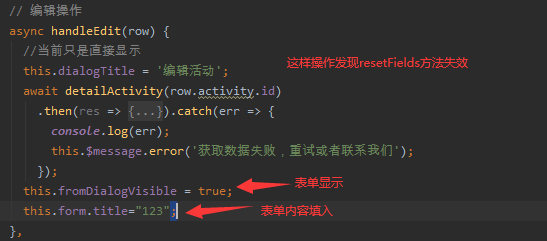
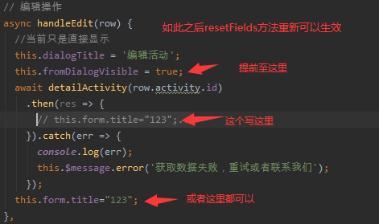
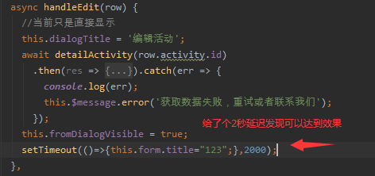

解决了，但是还不明白为什么会这样。不明白这个bug为什么会发生（不明白这个bug的本质）
# resetFields失效

## 问题描述

* element-ui使用表单时。编辑时，请求到数据，写入表单。resetFields失效。
* （出自：项目dty-sj-bops-system（下属的views/activity中）

## 解决方案

* 直接上代码图片

## 猜测

* 可能是dom还未渲染完成，数据还未绑定，我直接进行的数据更改 

验证猜测正确

* resetFields记住了我更改后的数据为初始数据，来重置

验证猜测正确

## 后续待解决

* 有空需要去拜读下element-ui的源码才可以理解为什么会这样。