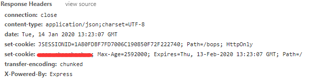
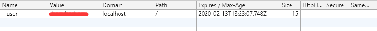
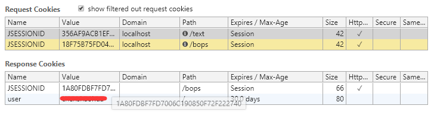
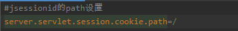
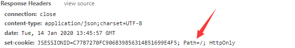
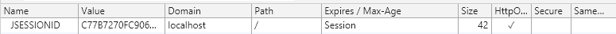

# problem : 

### http相应的response中headers中的set-cookie的值没有写入到本地的cookies中




没有把JSESSIONID写入到本地的cookies中

# 排查：


最后发现是这个path影响了这个的存储

# 解决：

### 在后端SpringBoot的配置中加入

``` JAVA
server.servlet.session.cookie.path=/
```



# 结果：





# 总结：

关于`path`和`domain`等对cookies存储的影响也可以使用这个方法配置解决