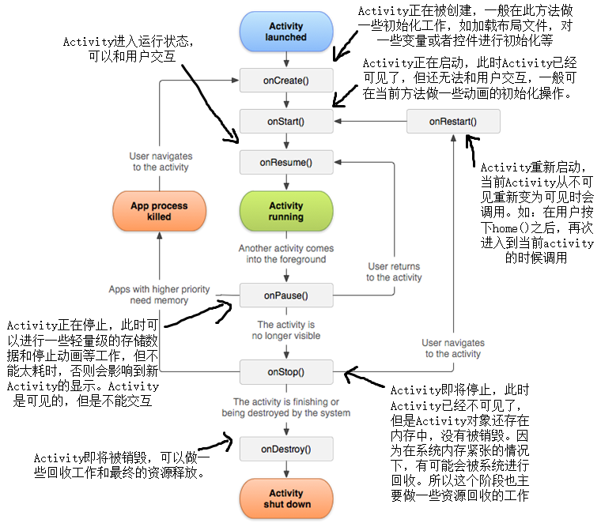

# Activity生命周期和启动模式

先上生命周期图

## onCreate

* 表示Activity正在被创建，做一些初始化工作，如: 加载布局文件，对一些变量或者控件进行初始化

## onStart

* 表示Activity正在启动，此时Activity已经可见了，但还无法和用户交互, 一般可在当前方法做一些动画的初始化操作。

## onResume

* 表示Activity已经在前台，当前Activity处于运行状态 (Running)，可以和用户交互了。

## onPause

* 表示Activity正在停止（当另外一个Activity覆盖当前的Activity时）此时是可见的，此时可以进行一些轻量级的存储数据和停止动画等工作，但不能太耗时，否则会影响到新Activity的显示, Android指定如果onPause在500ms内没有执行完毕的话就会强制关闭Activity。某些极端情况下，这个时候Activity会回到当前Activity，此时onResume会被执行，很难重现这一情形。

## onStop

* 表示Activity即将停止，此时Activity已经不可见了，但是Activity对象还存在内存中，没有被销毁，因为在系统内存紧张的情况下，有可能会被系统进行回收。所以一般在当前方法可做资源回收。

## onDestory

* 表示Activity即将被销毁，可以做一些回收工作和最终的资源释放。

## onRestart

* 表示Activity重新启动，当前Activity从不可见重新变为可见时会调用onRestart，这种情况一般是用户的行为导致。如：用户按下home()之后，再次进入到当前Activity的时候调用。

## onCreate，onStart和onResume之间的区别

* 由图，我们显然可以看出 `onCreate` 只会被调用一次，是在这个Activity被创建时。 `onStart` 和 `onResume` 可以多次被调用。因此数据恢复在 `onStart` 方法中比较合适， `onResume` 方法可以做一些开启动画和独占设备的操作

* `onCreate` 时Activity不可见； `onStart` 时Activity可见，但是不在前台（无法交互）； `onResume` 时Activity可见，并在前台（可以交互）。

## onPause，onStop和onDestroy之间的区别

* 由图，我们显然可以看出 `onDestory` 只会被调用一次，是在这个Activity被销毁时。 `onPause` 和 `onStop` 可以多次被调用。因此在 `onDestory` 方法中要收回前面没有收回的资源。

* `onPause` 时Activity还可见， `onStop` 已经不可见，但Activity对象还存在内存中， `onDestroy` 后Activity对象就不存在了

***

# Activity的启动模式

1. Standard 标准模式(默认模式)

* 每次启动一个Activity都会又一次创建一个新的实例入栈，无论这个实例是否存在。

* 生命周期：每次被创建的实例Activity 的生命周期正常，它的onCreate、onStart、onResume都会被调用

* 例子：在Activity b中加入点击事件，须要跳转到一个同类型的Activity b。结果是还有一个Activity b进入栈中，成为栈顶。

2. SingleTop 栈顶复用模式

* 两种处理情况：①须要创建的Activity已经处于栈顶时，此时会直接复用栈顶的Activity。不会再创建新的Activity；②若须要创建的Activity不处于栈顶，此时会又一次创建一个新的Activity入栈，同Standard模式一样。

* 生命周期：若情况一：栈顶的Activity被直接复用时，它的onCreate、onStart不会被调用。方法onNewIntent会被调用（Activity被正常创建时不会回调此方法）。

* 例子：情况一：在Activity b中加入点击事件，须要跳转到一个同类型的Activity b。直接复用栈顶的Activity b（调用方法onNewIntent一次）情况二：在Activity b中加入点击事件，须要跳转到的Activity a。创建新的Activity a入栈

3. SingleTask 栈内复用模式

* 若须要创建的Activity已经处于栈中时，此时不会创建新的Activity，而是将存在栈中的Activity上面的其他Activity所有销毁，使它成为栈顶。

* 生命周期：调用方法onNewIntent一次

* 例子：情况一：在Activity b中加入点击事件，须要跳转到一个同类型的Activity b。直接复用栈顶的Activity b（调用方法onNewIntent一次）情况二：在Activity b中加入点击事件，须要跳转到的Activity a。把Activity a上的Activity b给销毁（调用方法onNewIntent一次）情况三：在Activity b中加入点击事件，须要跳转到的Activity c。创建Activity c入栈

4. SingleInstance 单实例模式

* 这是一种加强的singleTask模式，除了具有singleTask模式的所有特性外，具有此种模式的Activity只能单独位于一个任务栈中。

* 这个经常使用于系统中的应用，比如锁屏键的应用等等，整个系统中仅仅有一个！在我们自己的应用中一般不会用到。

* 比如Activity a以singleInstance模式启动，系统会为其创建一个新的任务栈，然后a独自运行在该任务栈中，后续的请求均不会创建新的Activity。

* 补充：任务栈：在启动模式中多次提到Activity的任务栈，默认情况下，所有Activity所需任务栈的名字为应用的包名。此外还有一个参数TaskAffinity，这个参数标识了Activity所需要的任务栈的名字，TaskAffinity属性主要和singleTask模式或allowTaskReparenting属性配对使用。具体请参考（<a href = https://blog.csdn.net/guolin_blog/article/details/41087993>Android任务和返回栈完全解析，细数那些你所不知道的细节</a>）