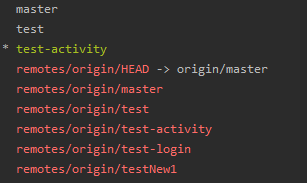
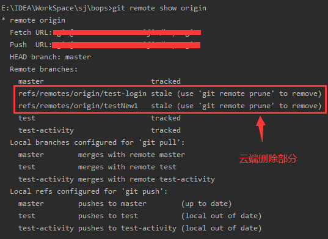
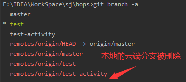
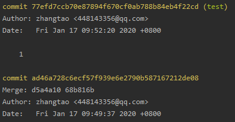
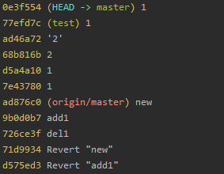
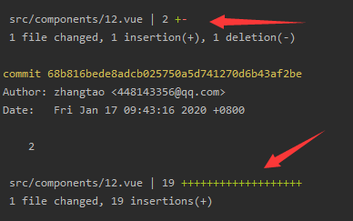

# git study

## 基本概念

* 工作区：就是你在电脑里能看到的目录。
* 暂存区：英文叫stage, 或index。一般存放在 ".git目录下" 下的index文件（.git/index）中，所以我们把暂存区有时也叫作索引（index）。
* 版本库：工作区有一个隐藏目录.git，这个不算工作区，而是Git的版本库。


## 创建仓库(git init, git clone)

### `git init` 

* 在当前目录初始化git仓库，在当前目录生成一个隐藏的(.git文件)

### `git clone` 

* 使用 git clone 从现有 Git 仓库中拷贝项目

## git基本操作

### `git status` 

* 展示当前的本地git仓库的状态

### `git add .` 

* 把工作区改动的文件添加到本地的git暂存区

### `git commit -m"message(你想要的注释的信息)"` 

* 把现在git暂存区的提交到git的版本库

### `git push` 

* 把本地的版本库提交到git远端的仓库

### `git pull` 

* 把远端的git仓库download到本地

### `git reset` 

* 6162b421
* 6162b42e
* 6162b422

`git reset 6162b42e --hard` 是回到6162b42e这个版本提交的情况下。回退到6162b42e这个版本

`git reset 6162b42e(这个为这个版本的唯一表示字符串)` 
`git reset 6162b42e --hard` 指定那种模式
`git reset HEAD~2` 回到2个版本前

* 默认是 `mixed` 模式

#### 三种模式

##### `hard` 

* 重置位置的同时，直接将工作区、暂存区及版本库都重置成目标reset节点的內容（工作区回到提交的reset节点的情况下）

##### `mixed` 

* 重置位置的同时，只保留工作区的內容，但会将暂存区和版本库中的內容更改和reset目标节点一致（版本库信息回到你reset节点的情况下，保留你后面的修改内容在工作区中）

##### `soft` 

* 重置位置的同时，保留工作区和暂存区的内容，只让版本库中的内容和reset目标节点保持一致（相当于mixed模式下它帮你 `git add .` 了一下）

### git revert

* 6162b423
* 6162b421
* 6162b42e
* 6162b422

`git reset 6162b42e` 是撤销6162b42e这次及以后的提交，相当于现在的工作空间 `git push` 了 `6162b422` 这个版本（当时是能push以前的版本的。只是相当于），发生冲突需要解决。以这个命令拿到历史版本内容，然后可以 `git add .` 、 `git commit -m""` 来提交。

* 这样可以push到远端。

* 前面的 `git reset` 会使本地版本比远端的旧，不能直接push。需要强性push。 `git push -f` 

## 分支

### `git branch` 

* `git branch` 查看本地所有分支

### `git branch (branchname)` 

* `git branch test` 创建了一个test分支

### `git checkout (branchname)` 

* `git checkout (test)` 把分支切换到了test

### `git checkout -b (branchname)` 

* `git checkout -b test` 创建并切换到test分支

### `git branch -D (branchname)` 

* `git branch -D test` 删除test分支

### `git merge (branchname)` 

* `git merge test` 把test分支合并到当前所在的分支中会发生冲突，解决冲突即可。

### `git branch -a`

* `git branch -a` 查看本地分支和远程分支情况 


下面部分为操作前的



### `git remote show origin`

* `git remote show origin` 查看本地分支和追踪情况



### `git remote prune origin`

* `git remote prune origin` 删除本地库中云端的分支




## 日志

### `git log` 

* `git log` 结果如下



* `git log --oneline` 



* `git log --stat` 多了文件修改显示



## `git stash` 暂存(参考https://www.cnblogs.com/zndxall/archive/2018/09/04/9586088.html)

* `git stash save "save message"` : 执行存储时，添加备注，方便查找，只有git stash 也要可以的，但查找时不方便识别。

是把暂存区的东西缓存起来。记得`git add .`到暂存区先

* `git stash pop` ：命令恢复之前缓存的工作目录，将缓存堆栈中的对应 `stash` 删除，并将对应修改应用到当前的工作目录下, 默认为第一个 `stash` , 即 `stash@{0}` ，如果要应用并删除其他 `stash` ，命令： `git stash pop stash@{$num}` ，比如应用并删除第二个： `git stash pop stash@{1}` 

* `git stash list` ：查看stash了哪些存储

* `git stash show` ：显示做了哪些改动，默认 `show` 第一个存储, 如果要显示其他存贮，后面加 `stash@{$num}` ，比如第二个 `git stash show stash@{1}` 

* `git stash show -p` : 显示第一个存储的改动，如果想显示其他存存储，命令： `git stash show  stash@{$num}  -p ` ，比如第二个： `git stash show  stash@{1}  -p` 

* `git stash apply` : 应用某个存储, 但不会把存储从存储列表中删除，默认使用第一个存储, 即 `stash@{0}` ，如果要使用其他个， `git stash apply stash@{$num}` ， 比如第二个： `git stash apply stash@{1}` 

* `git stash drop stash@{$num}` ：丢弃 `stash@{$num}` 存储，从列表中删除这个存储

* `git stash clear` ：删除所有缓存的 `stash` 


# 在查阅资料时发现别人不错的总结

## 来自（https://www.cnblogs.com/qdhxhz/p/9757390.html）

### 新建代码库

```
# 在当前目录新建一个Git代码库
git init
# 新建一个目录，将其初始化为Git代码库
git init [project-name]
# 下载一个项目和它的整个代码历史
git clone [url]
```

### 查看文件状态

```
#查看指定文件状态
git status [filename]
#查看所有文件状态
git status
```

### 工作区<-->暂存区

```
# 添加指定文件到暂存区
git add [file1] [file2] ...
# 添加指定目录到暂存区，包括子目录
git add [dir]
# 添加当前目录的所有文件到暂存区
git add .
#当我们需要删除暂存区或分支上的文件, 同时工作区也不需要这个文件了, 可以使用（⚠️）
git rm file_path
#当我们需要删除暂存区或分支上的文件, 但本地又需要使用, 这个时候直接push那边这个文件就没有，如果push之前重新add那么还是会有。
git rm --cached file_path
#直接加文件名   从暂存区将文件恢复到工作区，如果工作区已经有该文件，则会选择覆盖
#加了【分支名】 +文件名  则表示从分支名为所写的分支名中拉取文件 并覆盖工作区里的文件
git checkout
```

### 工作区<-->资源库（版本库）

```
#将暂存区-->资源库（版本库）
git commit -m '该次提交说明'
#如果出现:将不必要的文件commit 或者 上次提交觉得是错的  或者 不想改变暂存区内容，只是想调整提交的信息
#移除不必要的添加到暂存区的文件
git reset HEAD 文件名
#去掉上一次的提交（会直接变成add之前状态）   
git reset HEAD^ 
#去掉上一次的提交（变成add之后，commit之前状态） 
git reset --soft  HEAD^ 
```

### 远程操作

```
# 取回远程仓库的变化，并与本地分支合并
git pull
# 上传本地指定分支到远程仓库
git push
```

### 其它常用命令

```
# 显示当前的Git配置
git config --list
# 编辑Git配置文件
git config -e [--global]
#初次commit之前，需要配置用户邮箱及用户名，使用以下命令：
git config --global user.email "you@example.com"
git config --global user.name "Your Name"
#调出Git的帮助文档
git --help
#查看某个具体命令的帮助文档
git +命令 --help
#查看git的版本
git --version
```