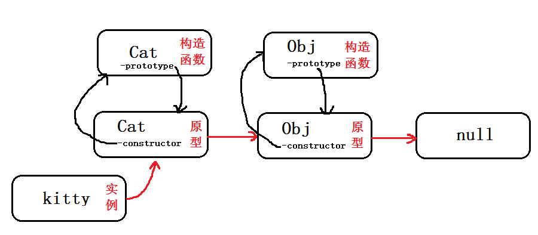
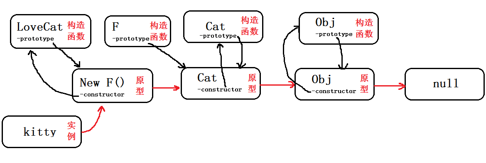

# JavaScript笔记（本笔记中的代码全部为strict模式下）

> 本学习笔记基于<a href='https://www.liaoxuefeng.com/wiki/1022910821149312'>廖雪峰的js教程</a>记录

## 数据类型和变量

### Number
**JavaScript不区分整数和浮点数，统一用Number表示，以下都是合法的Number类型：**

``` JavaScript
123; // 整数123
0.456; // 浮点数0.456
1.2345e2; // 科学计数法表示1.2345x1000，等同于123.45
(-9); // 负数
NaN; // NaN表示Not a Number，当无法计算结果时用NaN表示
Infinity; // Infinity表示无限大，当数值超过了JavaScript的Number所能表示的最大值时，就表示为Infinity
```

**Number可以直接做四则运算，规则和数学一致**

### 字符串（String）

**字符串是以单引号'或双引号"括起来的任意文本，比如 ` ` 'abc' `  ` ， `  ` "xyz" ` ` 等等。**

### 布尔值（Boolean）

**只有两个值， `true`  `false` ，可以直接用 `true`  `false` 来表达，也可以通过布尔运算计算出来**

**三个运算符号： `&&` 与 `||` 或 `!` 非，使用方法和其他语言相同**

**比较运算符：其他和其他语言相同，注意 `==` 和 `===` **

`==` 比较，它会自动转换数据类型再比较，很多时候，会得到非常诡异的结果；

`===` 比较，它不会自动转换数据类型，如果数据类型不一致，返回false，如果一致，再比较。

**另一个例外是NaN这个特殊的Number与所有其他值都不相等，包括它自己：**

``` JavaScript
NaN === NaN; // false
```

唯一能判断 `NaN` 的方法是通过 `isNaN()` 函数：

``` JavaScript
isNaN(NaN); // true
```

**注意浮点数的相等比较（每一个语言都要注意这个）**

``` JavaScript
1 / 3 === (1 - 2 / 3); // false
```

这是因为计算机无法精确的表示无限循环小数，要比较两个浮点数是否相等，通常采用计算它们之差的绝对值，看是否小于某个阈值

``` JavaScript
Math.abs(1 / 3 - (1 - 2 / 3)) < 0.0000001; // true
```

### `null` 和 `undefined` 

* `null` 表示一个“空”的值，它和 `0` 以及空字符串 `''` 不同， `0` 是一个数值， `''` 表示长度为0的字符串，而 `null` 表示“空”。
* `undefined` 仅仅在判断函数参数是否传递的情况下有用。

### 数组（Array）

**JavaScript的数组和其他语言不同，JavaScript的数组可以包括任意数据类型**

创建数组方法一：

``` JavaScript
[1, 2, 3.14, 'Hello', null, true];
```

上述数组包含6个元素。数组用 `[]` 表示，元素之间用 `,` 分隔。

创建数组方法二：

``` JavaScript
new Array(1, 2, 3); // 创建了数组[1, 2, 3]
```

推荐使用方法一

数组的元素可以通过索引来访问。请注意，索引的起始值为 `0` ：

``` JavaScript
var arr = [1, 2, 3.14, 'Hello', null, true];
arr[0]; // 返回索引为0的元素，即1
arr[5]; // 返回索引为5的元素，即true
arr[6]; // 索引超出了范围，返回undefined
```

### 对象（Object）

JavaScript的对象是一组由键-值组成的无序集合：

``` JavaScript
var person = {
    name: 'Bob',
    age: 20,
    tags: ['js', 'web', 'mobile'],
    city: 'Beijing',
    hasCar: true,
    zipcode: null
};
```

键都是字符串，值可以为任意数据类型。获取一个对象的属性们可以用 `对象变量.属性名` 的方式

``` JavaScript
person.name; // 'Bob'
person.zipcode; // null
```

### Symbol

`Symbol()`函数会返回`symbol`类型的值，该类型具有静态属性和静态方法。它的静态属性会暴露几个内建的成员对象；它的静态方法会暴露全局的`symbol`注册，且类似于内建对象类，但作为构造函数来说它并不完整，因为它不支持语法："`new Symbol()`"。

| 摘录于<a href='https://developer.mozilla.org/zh-CN/docs/Web/JavaScript/Reference/Global_Objects/Symbol'>MDN</a>


每个从`Symbol()`返回的symbol值都是唯一的。一个symbol值能作为对象属性的标识符

### 变量

命名规则：变量名是大小写英文、数字、$和_的组合，且不能用数字开头。变量名也不能是JavaScript的关键字，如 `if` 、 `while` 等。申明一个变量用 `var` 语句

``` JavaScript
var a; // 申明了变量a，此时a的值为undefined
var $b = 1; // 申明了变量$b，同时给$b赋值，此时$b的值为1
var s_007 = '007'; // s_007是一个字符串
var Answer = true; // Answer是一个布尔值true
var t = null; // t的值是null
```

***

## 字符串

JavaScript的字符串就是用''或""括起来的字符表示。

如果字符本身包含 `'`  `"` 可以采用转义字符 `\` 来表示

`'I\'m \"OK\"!';` 

表示的字符串内容是： `I'm "OK"!` 

转义字符的使用和其他语音相同

### 多行字符串

``` 
 `这是一个
 多行
 字符串`;
 ```

### 模板字符串

要把多个字符串连接起来，可以用 `+` 号连接：

``` JavaScript
var name = '小明';
var age = 20;
var message = '你好, ' + name + ', 你今年' + age + '岁了!';
alert(message);
```

如果有很多变量需要连接，用+号就比较麻烦。ES6新增了一种模板字符串，表示方法和上面的多行字符串一样，但是它会自动替换字符串中的变量：

``` JavaScript
var name = '小明';
var age = 20;
var message = `你好, ${name}, 你今年${age}岁了!` ;
alert(message);
```

### 操作字符串

字符串常见的操作如下：

``` JavaScript
var s = 'Hello, world!';
s.length; // 13
```

要获取字符串某个指定位置的字符，使用类似Array的下标操作，索引号从0开始：

``` JavaScript
var s = 'Hello, world!';
s[0]; // 'H'
s[6]; // ' '
s[7]; // 'w'
s[12]; // '!'
s[13]; // undefined 超出范围的索引不会报错，但一律返回undefined
```

**注意: 字符串是不可变的，如果对字符串的某个索引赋值，不会有任何错误，但是，也没有任何效果:**

``` JavaScript
var s = 'Test';
s[0] = 'X';
alert(s); // s仍然为'Test'
```

JavaScript为字符串提供了一些常用方法，注意，调用这些方法本身不会改变原有字符串的内容，而是返回一个新字符串：

#### toUpperCase

`toUpperCase()` 把一个字符串全部变为大写：

``` JavaScript
var s = 'Hello';
s.toUpperCase(); // 返回'HELLO'
```

#### toLowerCase

`toLowerCase()` 把一个字符串全部变为小写：

``` JavaScript
var s = 'Hello';
var lower = s.toLowerCase(); // 返回'hello'并赋值给变量lower
lower; // 'hello'
```

#### indexOf

`indexOf()` 会搜索指定字符串出现的位置：

``` JavaScript
var s = 'hello, world';
s.indexOf('world'); // 返回7
s.indexOf('World'); // 没有找到指定的子串，返回-1
```

#### substring

`substring()` 返回指定索引区间的子串：

``` JavaScript
var s = 'hello, world'
s.substring(0, 5); // 从索引0开始到5（不包括5），返回'hello'
s.substring(7); // 从索引7开始到结束，返回'world'
```

***

## 数组

JavaScript的 `Array` 可以包含任意数据类型，并通过索引来访问每个元素。
`length` 可以直接获得 `Array` 的长度

``` JavaScript
var arr = [1, 2, 3.14, 'Hello', null, true];
arr.length; // 6
```

注意，直接给 `Array` 的 `length` 赋一个新的值会导致 `Array` 大小的变化：

``` JavaScript
var arr = [1, 2, 3];
arr.length; // 3
arr.length = 6;
arr; // arr变为[1, 2, 3, undefined, undefined, undefined]
arr.length = 2;
arr; // arr变为[1, 2]
```

`Array` 可以通过索引把对应的元素修改为新的值，因此，对 `Array` 的索引进行赋值会直接修改这个 `Array` ：

``` JavaScript
var arr = ['A', 'B', 'C'];
arr[1] = 99;
arr; // arr现在变为['A', 99, 'C']
```

注意, 如果通过索引赋值时，索引超过了范围，同样会引起Array大小的变化：

``` JavaScript
var arr = [1, 2, 3];
arr[5] = 'x';
arr; // arr变为[1, 2, 3, undefined, undefined, 'x']
```

大多数其他编程语言不允许直接改变数组的大小，越界访问索引会报错。然而，JavaScript的 `Array` 却不会有任何错误。在编写代码时，不建议直接修改 `Array` 的大小，访问索引时要确保索引不会越界。

### indexOf

与String类似， `Array` 也可以通过 `indexOf()` 来搜索一个指定的元素的位置：

``` JavaScript
var arr = [10, 20, '30', 'xyz'];
arr.indexOf(10); // 元素10的索引为0
arr.indexOf(20); // 元素20的索引为1
arr.indexOf(30); // 元素30没有找到，返回-1
arr.indexOf('30'); // 元素'30'的索引为2
```

### slice

`slice()` 就是对应String的 `substring()` 版本，它截取 `Array` 的部分元素，然后返回一个新的 `Array` ：

``` JavaScript
var arr = ['A', 'B', 'C', 'D', 'E', 'F', 'G'];
arr.slice(0, 3); // 从索引0开始，到索引3结束，但不包括索引3: ['A', 'B', 'C']
arr.slice(3); // 从索引3开始到结束: ['D', 'E', 'F', 'G']
```

注意 `slice()` 的起止参数包括开始索引，不包括结束索引。

如果不给 `slice()` 传递任何参数，它就会从头到尾截取所有元素。利用这一点，我们可以很容易地复制一个 `Array` ：

``` JavaScript
var arr = ['A', 'B', 'C', 'D', 'E', 'F', 'G'];
var aCopy = arr.slice();
var tCopy = arr;
tCopy; // ['A', 'B', 'C', 'D', 'E', 'F', 'G']
aCopy; // ['A', 'B', 'C', 'D', 'E', 'F', 'G']
aCopy === arr; // false
tCopy === arr; // true
```

### push和pop

`push()` 向 `Array` 的末尾添加若干元素， `pop()` 则把 `Array` 的最后一个元素删除掉：

``` JavaScript
var arr = [1, 2];
arr.push('A', 'B'); // 返回Array新的长度: 4
arr; // [1, 2, 'A', 'B']
arr.pop(); // pop()返回'B'
arr; // [1, 2, 'A']
arr.pop();
arr.pop();
arr.pop(); // 连续pop 3次
arr; // []
arr.pop(); // 空数组继续pop不会报错，而是返回undefined
arr; // []
```

### unshift和shift

如果要往 `Array` 的头部添加若干元素，使用 `unshift()` 方法， `shift()` 方法则把Array的第一个元素删掉：

``` JavaScript
var arr = [1, 2];
arr.unshift('A', 'B'); // 返回Array新的长度: 4
arr; // ['A', 'B', 1, 2]
arr.shift(); // 'A'
arr; // ['B', 1, 2]
arr.shift();
arr.shift();
arr.shift(); // 连续shift 3次
arr; // []
arr.shift(); // 空数组继续shift不会报错，而是返回undefined
arr; // []
```

### sort

`sort()` 可以对当前 `Array` 进行排序，它会直接修改当前 `Array` 的元素位置，直接调用时，按照默认顺序排序：

``` JavaScript
var arr = ['B', 'C', 'A'];
arr.sort();
arr; // ['A', 'B', 'C']
```

### reverse

`reverse()` 把整个 `Array` 的元素给反转：

``` JavaScript
var arr = ['one', 'two', 'three'];
arr.reverse();
arr; // ['three', 'two', 'one']
```

### concat

`concat()` 方法把当前的 `Array` 和另一个 `Array` 连接起来，并返回一个新的 `Array` ：

``` JavaScript
var arr = ['A', 'B', 'C'];
var added = arr.concat([1, 2, 3]);
added; // ['A', 'B', 'C', 1, 2, 3]
arr; // ['A', 'B', 'C']
```

### splice

`splice()` 方法是修改 `Array` 的“万能方法”，它可以从指定的索引开始删除若干元素，然后再从该位置添加若干元素：

``` JavaScript
var arr = ['Microsoft', 'Apple', 'Yahoo', 'AOL', 'Excite', 'Oracle'];
// 从索引2开始删除3个元素,然后再添加两个元素:
arr.splice(2, 3, 'Google', 'Facebook'); // 返回删除的元素 ['Yahoo', 'AOL', 'Excite']
arr; // ['Microsoft', 'Apple', 'Google', 'Facebook', 'Oracle']
// 只删除,不添加:
arr.splice(2, 2); // ['Google', 'Facebook']
arr; // ['Microsoft', 'Apple', 'Oracle']
// 只添加,不删除:
arr.splice(2, 0, 'Google', 'Facebook'); // 返回[],因为没有删除任何元素
arr; // ['Microsoft', 'Apple', 'Google', 'Facebook', 'Oracle']
```

### join

`join()` 方法是一个非常实用的方法，它把当前 `Array` 的每个元素都用指定的字符串连接起来，然后返回连接后的字符串

``` JavaScript
var arr = ['A', 'B', 'C', 1, 2, 3];
arr.join('-'); // 'A-B-C-1-2-3'
```

如果 `Array` 的元素不是字符串，将自动转换为字符串后再连接。

### 多维数组

如果数组的某个元素又是一个 `Array` ，则可以形成多维数组，例如：

``` JavaScript
var arr = [
    [1, 2, 3],
    [400, 500, 600],
    "-"
];
```

通过索引取到500这个值：

``` JavaScript
var x = arr[1][1];
console.log(x);
```

***

## 对象

JavaScript的对象是一种无序的集合数据类型，它由若干键值对组成。

JavaScript的对象用于描述现实世界中的某个对象。

``` JavaScript
var xiaoming = {
    name: '小明',
    birth: 1990,
    school: 'No.1 Middle School',
    height: 1.70,
    weight: 65,
    score: null
};
//如果属性名包含特殊字符，就必须用''括起来：
var xiaohong = {
    name: '小红',
    'middle-school': 'No.1 Middle School'
};
```

中间的键值用 `,` 隔开，最后一个键值不需要 `,` 加了的话部分浏览器可能会报错。

访问一个属性用变量名加 `.` 即可， `xiaohon` g的属性名 `middle-school` 不是一个有效的变量，就需要用 `''` 括起来。访问这个属性也无法使用. 操作符，必须用 `['xxx']` 来访问：

``` JavaScript
xiaohong['middle-school']; // 'No.1 Middle School'
xiaohong['name']; // '小红'
xiaohong.name; // '小红'
```

也可以用 `xiaohong['name']` 来访问 `xiaohong` 的 `name` 属性，不过 `xiaohong.name` 的写法更简洁。我们在编写JavaScript代码的时候，属性名尽量使用标准的变量名，这样就可以直接通过 `object.prop` 的形式访问一个属性了。

由于JavaScript的对象是动态类型，你可以自由地给一个对象添加或删除属性：

``` JavaScript
var xiaoming = {
    name: '小明'
};
xiaoming.age; // undefined
xiaoming.age = 18; // 新增一个age属性
xiaoming.age; // 18
delete xiaoming.age; // 删除age属性
xiaoming.age; // undefined
delete xiaoming['name']; // 删除name属性
xiaoming.name; // undefined
delete xiaoming.school; // 删除一个不存在的school属性也不会报错
```

如果我们要检测 `xiaoming` 是否拥有某一属性，可以用in操作符：

``` JavaScript
var xiaoming = {
    name: '小明',
    birth: 1990,
    school: 'No.1 Middle School',
    height: 1.70,
    weight: 65,
    score: null
};
'name' in xiaoming; // true
'grade' in xiaoming; // false
```

不过要小心，如果 `in` 判断一个属性存在，这个属性不一定是 `xiaoming` 的，它可能是 `xiaoming` 继承得到的：

``` JavaScript
'toString' in xiaoming; // true
```

因为 `toString` 定义在 `object` 对象中，而所有对象最终都会在原型链上指向 `object` ，所以 `xiaoming` 也拥有 `toString` 属性。

要判断一个属性是否是 `xiaoming` 自身拥有的，而不是继承得到的，可以用 `hasOwnProperty()` 方法：

``` JavaScript
var xiaoming = {
    name: '小明'
};
xiaoming.hasOwnProperty('name'); // true
xiaoming.hasOwnProperty('toString'); // false
```

***

## 条件判断

### if
if语句和其他大多数语言相同，仅附加一个案例：

``` JavaScript
var height = 1.75;
var weight = 80.5;
var bmi = 80.5 / 1.75 / 1.75;
if (bmi < 18.5) {
    console.log('过轻');
} else if (bmi <= 25) {
    console.log('正常');
} else if (bmi <= 28) {
    console.log('过重');
} else if (bmi <= 32) {
    console.log('肥胖');
} else {
    console.log('严重肥胖');
}
```

### switch

switch语句和其他大多数语言相同，仅附加一个案例：

``` JavaScript
switch (new Date().getDay()) {
    case 6:
        text = "今天是周六";
        break;
    case 0:
        text = "今天是周日";
        break;
    default:
        text = "期待周末~";
}
```

***

## 循环

### for

for语句和其他的大多数语言相同，仅附加一个案例：

``` JavaScript
var arr = ['Apple', 'Google', 'Microsoft'];
var i, x;
for (i = 0; i < arr.length; i++) {
    x = arr[i];
    console.log(x);
}
```

**for...in**

`for` 循环的一个变体是 `for ... in` 循环，它可以把一个对象的所有属性依次循环出来：

``` JavaScript
var o = {
    name: 'Jack',
    age: 20,
    city: 'Beijing'
};
for (var key in o) {
    console.log(key); // 'name', 'age', 'city'
}
```

要过滤掉对象继承的属性，用 `hasOwnProperty()` 来实现：

``` JavaScript
var o = {
    name: 'Jack',
    age: 20,
    city: 'Beijing'
};
for (var key in o) {
    if (o.hasOwnProperty(key)) {
        console.log(key); // 'name', 'age', 'city'
    }
}
```

由于 `Array` 也是对象，而它的每个元素的索引被视为对象的属性，因此， `for ... in` 循环可以直接循环出Array的索引：

``` JavaScript
var a = ['A', 'B', 'C'];
for (var i in a) {
    console.log(i); // '0', '1', '2'
    console.log(a[i]); // 'A', 'B', 'C'
}
```

请注意， `for ... in` 对 `Array` 的循环得到的是 `String` 而不是 `Number` 。

### while

while语句和其他的大多数语言相同，仅附加几个案例：

``` JavaScript
var x = 0;
var n = 99;
while (n > 0) {
    x = x + n;
    n = n - 2;
}
x; // 2500
```

do...while

``` JavaScript
var n = 0;
do {
    n = n + 1;
} while (n < 100);
n; // 100
```

***

## Map和Set

### Map

`Map` 是一组键值对的结构，具有极快的查找速度。

``` JavaScript
var m = new Map([
    ['Michael', 95],
    ['Bob', 75],
    ['Tracy', 85]
]);
m.get('Michael'); // 95
```

初始化Map需要一个二维数组，或者直接初始化一个空Map。Map具有以下方法：

``` JavaScript
var m = new Map(); // 空Map
m.set('Adam', 67); // 添加新的key-value
m.set('Bob', 59);
m.has('Adam'); // 是否存在key 'Adam': true
m.get('Adam'); // 67
m.delete('Adam'); // 删除key 'Adam'
m.get('Adam'); // undefined
```

由于一个key只能对应一个value，所以，多次对一个key放入value，后面的值会把前面的值冲掉：

``` JavaScript
var m = new Map();
m.set('Adam', 67);
m.set('Adam', 88);
m.get('Adam'); // 88
```

### Set

`Set` 和 `Map` 类似，也是一组 `key` 的集合，但不存储 `value` 。由于 `key` 不能重复，所以，在 `Set` 中，没有重复的 `key` 。

要创建一个 `Set` ，需要提供一个 `Array` 作为输入，或者直接创建一个空 `Set` ：

``` JavaScript
var s1 = new Set(); // 空Set
var s2 = new Set([1, 2, 3]); // 含1, 2, 3
//重复元素在Set中自动被过滤：
var s = new Set([1, 2, 3, 3, '3']);
s; // Set {1, 2, 3, "3"}
```

通过 `add(key)` 方法可以添加元素到 `Set` 中，可以重复添加，但不会有效果：

``` JavaScript
s.add(4);
s; // Set {1, 2, 3, 4}
s.add(4);
s; // 仍然是 Set {1, 2, 3, 4}
```

通过 `delete(key)` 方法可以删除元素：

``` JavaScript
var s = new Set([1, 2, 3]);
s; // Set {1, 2, 3}
s.delete(3);
s; // Set {1, 2}
```

***

## iterable

遍历 `Array` 可以采用下标循环，遍历 `Map` 和 `Set` 就无法使用下标。为了统一集合类型，ES6标准引入了新的 `iterable` 类型， `Array` 、 `Map` 和 `Set` 都属于 `iterable` 类型。

### for...of

用for ...of循环遍历集合，用法如下：

``` JavaScript
var a = ['A', 'B', 'C'];
var s = new Set(['A', 'B', 'C']);
var m = new Map([
    [1, 'x'],
    [2, 'y'],
    [3, 'z']
]);
for (var x of a) { // 遍历Array
    console.log(x);
}
for (var x of s) { // 遍历Set
    console.log(x);
}
for (var x of m) { // 遍历Map
    console.log(x[0] + '=' + x[1]);
}
```

`for ... of` 循环和 `for ... in` 循环的区别

``` JavaScript
var a = ['A', 'B', 'C'];
a.name = 'Hello';
for (var x in a) {
    console.log(x); // '0', '1', '2', 'name'
}
//for ... in循环将把name包括在内，但Array的length属性却不包括在内。

var a = ['A', 'B', 'C'];
a.name = 'Hello';
for (var x of a) {
    console.log(x); // 'A', 'B', 'C'
}
```

更好的方式是直接使用 `iterable` 内置的 `forEach` 方法，它接收一个函数，每次迭代就自动回调该函数。以 `Array` 为例：

``` JavaScript
var a = ['A', 'B', 'C'];
a.forEach(function(element, index, array) {
    // element: 指向当前元素的值
    // index: 指向当前索引
    // array: 指向Array对象本身
    console.log(element + ', index = ' + index);
});
```

**注意， `forEach()` 方法是ES5.1标准引入的，你需要测试浏览器是否支持。**

以下为 `Set` 和 `Map` 的演示

``` JavaScript
//Set
var s = new Set(['A', 'B', 'C']);
s.forEach(function(element, sameElement, set) {
    console.log(element);
});
//Map
var m = new Map([
    [1, 'x'],
    [2, 'y'],
    [3, 'z']
]);
m.forEach(function(value, key, map) {
    console.log(value);
});
```

如果对某些参数不感兴趣，由于JavaScript的函数调用不要求参数必须一致，因此可以忽略它们。例如，只需要获得 `Array` 的 `element` ：

``` JavaScript
var a = ['A', 'B', 'C'];
a.forEach(function(element) {
    console.log(element);
});
```

***
***

## 函数

### 定义函数

函数定义的方式如下：

``` JavaScript
function abs(x) {
    if (x >= 0) {
        return x;
    } else {
        return -x;
    }
}
```

上述 `abs(x)` 函数的定义如下：

* `function` 指出这是一个函数定义；
* `abs` 是函数的名称；
* `(x)` 括号内列出函数的参数，多个参数以, 分隔；
* `{ ... }` 之间的代码是函数体，可以包含若干语句，甚至可以没有任何语句。
* 函数体内部的语句在执行时，一旦执行到 `return` 时，函数就执行完毕，并将结果返回。如果没有 `return` 语句，函数执行完毕后也会返回结果，只是结果为 `undefined` 。

由于JavaScript的函数也是一个对象，上述定义的 `abs()` 函数实际上是一个函数对象，而函数名 `abs` 可以视为指向该函数的变量。

因此，第二种定义函数的方式如下：

``` JavaScript
var abs = function(x) {
    if (x >= 0) {
        return x;
    } else {
        return -x;
    }
};
```

在这种方式下， `function (x) { ... }` 是一个匿名函数，它没有函数名。但是，这个匿名函数赋值给了变量 `abs` ，所以，通过变量 `abs` 就可以调用该函数。

上述两种定义完全等价，注意第二种方式按照完整语法需要在函数体末尾加一个 `;` ，表示赋值语句结束。

***

### 函数调用

和其他语言一样，按顺序传入参数即可

``` JavaScript
abs(10); // 返回10
abs(-9); // 返回9

//由于JavaScript允许传入任意个参数而不影响调用，因此传入的参数比定义的参数多也没有问题，虽然函数内部并不需要这些参数：
abs(10, 'blablabla'); // 返回10
abs(-9, 'haha', 'hehe', null); // 返回9

//传入的参数比定义的少也没有问题：
abs(); // 返回NaN
```

此时 `abs(x)` 函数的参数 `x` 将收到 `undefined` ，计算结果为 `NaN` 。

要避免收到 `undefined` ，可以对参数进行检查：

``` JavaScript
function abs(x) {
    if (typeof x !== 'number') {
        throw 'Not a number';
    }
    if (x >= 0) {
        return x;
    } else {
        return -x;
    }
}
```

***

### arguments

JavaScript还有一个免费赠送的关键字 `arguments` ，它只在函数内部起作用，并且永远指向当前函数的调用者传入的所有参数。 `arguments` 类似 `Array` 但它不是一个 `Array` ：

``` JavaScript
function foo(x) {
    console.log('x = ' + x); // 10
    for (var i = 0; i < arguments.length; i++) {
        console.log('arg ' + i + ' = ' + arguments[i]); // 10, 20, 30
    }
}
foo(10, 20, 30);
/*运行结果：
x = 10
arg 0 = 10
arg 1 = 20
arg 2 = 30
*/
```

利用 `arguments` ，你可以获得调用者传入的所有参数。也就是说，即使函数不定义任何参数，还是可以拿到参数的值：

``` JavaScript
function abs() {
    if (arguments.length === 0) {
        return 0;
    }
    var x = arguments[0];
    return x >= 0 ? x : -x;
}

abs(); // 0
abs(10); // 10
abs(-9); // 9
```

实际上 `arguments` 最常用于判断传入参数的个数。你可能会看到这样的写法：

``` JavaScript
// foo(a[, b], c)
// 接收2~3个参数，b是可选参数，如果只传2个参数，b默认为null：
function foo(a, b, c) {
    if (arguments.length === 2) {
        // 实际拿到的参数是a和b，c为undefined
        c = b; // 把b赋给c
        b = null; // b变为默认值
    }
    // ...
}
//要把中间的参数b变为“可选”参数，就只能通过arguments判断，然后重新调整参数并赋值
```

***

### rest参数

由于JavaScript函数允许接收任意个参数，于是我们就不得不用 `arguments` 来获取所有参数：

``` JavaScript
function foo(a, b) {
    var i, rest = [];
    if (arguments.length > 2) {
        for (i = 2; i < arguments.length; i++) {
            rest.push(arguments[i]);
        }
    }
    console.log('a = ' + a);
    console.log('b = ' + b);
    console.log(rest);
}
```

ES6标准引入了rest参数，上面的函数可以改写为：

``` JavaScript
function foo(a, b, ...rest) {
    console.log('a = ' + a);
    console.log('b = ' + b);
    console.log(rest);
}

foo(1, 2, 3, 4, 5);
// 结果:
// a = 1
// b = 2
// Array [ 3, 4, 5 ]

foo(1);
// 结果:
// a = 1
// b = undefined
// Array []
```

`rest` 参数只能写在最后，前面用 `...` 标识，从运行结果可知，传入的参数先绑定 `a` 、 `b` ，多余的参数以数组形式交给变量 `rest` ，所以，不再需要 `arguments` 我们就获取了全部参数。

如果传入的参数连正常定义的参数都没填满，也不要紧， `rest` 参数会接收一个空数组（注意不是 `undefined` ）。

***

### js的行末自动添加分号的机制（**坑**）

js并不是在每一行结尾加上分号，而是当你这行代码能够正常被解析的时候，就会在结尾加上分号，如果不能解析，则合并下一句代码，直到可以解析为止。

``` JavaScript
//例如：
b =
    1
//上面的代码会解析成：b = 1;

//当我某一行代码不写分号，而下一行代码是以“(” 开头的，即使这行语句是可解析的语句，也会将两行代码合并为一行进行解析。正是因为这种机制，所以在js中写代码的时候，会出现一些跟你意料中不一样的结果。比如说：
a = 1

(a + 2).toString()
//上面的代码我们认为它会这样执行：
a = 1;
(a + 2).toString();
//但事实上，它是这样执行的：
a = 1(a + 2).toString();
最终结果： Uncaught ReferenceError: a is not defined
```

还有其他的一些情况下也会出现这样的情况，所以为了程序不出现意料之外的结果，养好良好的js编码习惯，建议大家在每条语句结束时手动加上分号，同时这也是为了项目上线之后进行代码压缩所做的准备工作。

``` JavaScript
function foo() {
    return {
        name: 'foo'
    };
}

foo(); // { name: 'foo' }

//如果把return语句拆成两行：
function foo() {
    return {
        name: 'foo'
    };
}

foo(); // undefined

//由于已上机制,上述代码变为
function foo() {
    return; // 自动添加了分号，相当于return undefined;
    {
        name: 'foo'
    }; // 这行语句已经没法执行到了
}

//所以正确的多行写法是：
function foo() {
    return { // 这里不会自动加分号，因为{表示语句尚未结束
        name: 'foo'
    };
}
```

***

### 变量作用域与解构赋值

在JavaScript中，用 `var` 申明的变量实际上是有作用域的。

``` JavaScript
//如果一个变量在函数体内部申明，则该变量的作用域为整个函数体，在函数体外不可引用该变量：
function foo() {
    var x = 1;
    x = x + 1;
}

x = x + 2; // ReferenceError! 无法在函数体外引用变量x

//JavaScript的函数可以嵌套,JavaScript的函数在查找变量时从自身函数定义开始，从“内”向“外”查找。如果内部函数定义了与外部函数重名的变量，则内部函数的变量将“屏蔽”外部函数的变量。

function foo() {
    var x = 1;

    function bar() {
        var x = 'A';
        console.log('x in bar() = ' + x); // 'A'
    }
    console.log('x in foo() = ' + x); // 1
    bar();
}

foo();
```

***

### 变量提升

JavaScript的函数定义有个特点，它会先扫描整个函数体的语句，把所有申明的变量“提升”到函数顶部：

``` JavaScript
function foo() {
    var x = 'Hello, ' + y;
    console.log(x);
    var y = 'Bob';
}

foo();

//但语句var x = 'Hello, ' + y;并不报错，原因是变量y在稍后申明了。但是console.log显示Hello, undefined，说明变量y的值为undefined。这正是因为JavaScript引擎自动提升了变量y的声明，但不会提升变量y的赋值。

//相当于
function foo() {
    var y; // 提升变量y的申明，此时y为undefined
    var x = 'Hello, ' + y;
    console.log(x);
    y = 'Bob';
}
```

***

### 全局作用域

JavaScript默认有一个全局对象 `window` ，全局作用域的变量实际上被绑定到 `window` 的一个属性：

``` JavaScript
var course = 'Learn JavaScript';
alert(course); // 'Learn JavaScript'
alert(window.course); // 'Learn JavaScript'

//函数也被定义为一个全局变量，并绑定到window对象上
function foo() {
    alert('foo');
}

foo(); // 直接调用foo()
window.foo(); // 通过window.foo()调用
```

任何变量（函数也视为变量），如果没有在当前函数作用域中找到，就会继续往上查找，最后如果在全局作用域中也没有找到，则报 `eferenceError` 错误。

***

### 命名空间

全局变量会绑定到 `window` 上，不同的JavaScript文件如果使用了相同的全局变量，或者定义了相同名字的顶层函数，都会造成命名冲突，并且很难被发现。减少冲突的一个方法是把自己的所有变量和函数全部绑定到一个全局变量中。

``` JavaScript
// 唯一的全局变量MYAPP:
var MYAPP = {};

// 其他变量:
MYAPP.name = 'myapp';
MYAPP.version = 1.0;

// 其他函数:
MYAPP.foo = function() {
    return 'foo';
};

//把自己的代码全部放入唯一的名字空间MYAPP中，会大大减少全局变量冲突的可能。
```

***

### 局部作用域

这个和其他语言有所不同。

由于JavaScript的变量作用域实际上是函数内部，我们在for循环等语句块中是无法定义具有局部作用域的变量的：

``` JavaScript
function foo() {
    for (var i = 0; i < 100; i++) {
        //
    }
    i += 100; // 仍然可以引用变量i
}

//为了解决块级作用域，ES6引入了新的关键字let，用let替代var可以申明一个块级作用域的变量：

function foo() {
    var sum = 0;
    for (let i = 0; i < 100; i++) {
        sum += i;
    }
    // SyntaxError:
    i += 1;
}
```

***

### 常量

ES6标准引入了新的关键字 `const` 来定义常量， `const` 与 `let` 都具有块级作用域：

``` JavaScript
const PI = 3.14;
PI = 3; // 某些浏览器不报错，但是无效果！
PI; // 3.14
```

***

### 解构赋值

从ES6开始，JavaScript引入了解构赋值，可以同时对一组变量进行赋值。

``` JavaScript
//原来的方法
var array = ['hello', 'JavaScript', 'ES6'];
var x = array[0];
var y = array[1];
var z = array[2];

//解构赋值
var [x, y, z] = ['hello', 'JavaScript', 'ES6'];

//如果数组本身还有嵌套，也可以通过下面的形式进行解构赋值，注意嵌套层次和位置要保持一致：
let [x, [y, z]] = ['hello', ['JavaScript', 'ES6']];
x; // 'hello'
y; // 'JavaScript'
z; // 'ES6'

//解构赋值还可以忽略某些元素：
let [, , z] = ['hello', 'JavaScript', 'ES6']; // 忽略前两个元素，只对z赋值第三个元素
z; // 'ES6'

//对一个对象进行解构赋值时，同样可以直接对嵌套的对象属性进行赋值，只要保证对应的层次是一致的：
var person = {
    name: '小明',
    age: 20,
    gender: 'male',
    passport: 'G-12345678',
    school: 'No.4 middle school',
    address: {
        city: 'Beijing',
        street: 'No.1 Road',
        zipcode: '100001'
    }
};
var {
    name,
    passport: id,
    address: {
        city,
        zip
    },
    single = true
} = person;
name; // '小明'
id; // 'G-12345678'
// 注意: passport不是变量，而是为了让变量id获得passport属性:
passport; // Uncaught ReferenceError: passport is not defined
city; // 'Beijing'
zip; // undefined, 因为属性名是zipcode而不是zip
// 注意: address不是变量，而是为了让city和zip获得嵌套的address对象的属性:
address; // Uncaught ReferenceError: address is not defined
single; // true
```

有些时候，如果变量已经被声明了，再次赋值的时候，正确的写法也会报语法错误：

``` JavaScript
// 声明变量:
var x, y;
// 解构赋值:
{
    x,
    y
} = {
    name: '小明',
    x: 100,
    y: 200
};
// 语法错误: Uncaught SyntaxError: Unexpected token =
//这是因为JavaScript引擎把{开头的语句当作了块处理，于是=不再合法。解决方法是用小括号括起来：
({
    x,
    y
} = {
    name: '小明',
    x: 100,
    y: 200
});
```

***

### 方法

在一个对象中绑定函数，称为这个对象的方法。

``` JavaScript
var xiaoming = {
    name: '小明',
    birth: 1990,
    age: function() {
        var y = new Date().getFullYear();
        return y - this.birth;
    }
};

xiaoming.age; // function xiaoming.age()
xiaoming.age();
```

***

### **我对this的认识（坑）**

* this的指向在函数定义的时候是确定不了的，只有函数执行的时候才能确定this到底指向谁，实际上this的最终指向的是那个调用它的对象。

* 在 `strict` 模式下让函数的 `this` 指向 `undefined` 

``` JavaScript
//这句高于前一句，就是当用前一句判断出 `this` 是 `window` ，但是处于 `strict` 模式，那么函数的 `this` 就指向 `undefined` 
var xiaoming = {
    name: '小明',
    birth: 1990,
    age: function() {
        var y = new Date().getFullYear();
        this;
    }
};
var fn = xiaoming.age;
fn(); //this指向为window

//strict模式
'use strict';

var xiaoming = {
    name: '小明',
    birth: 1990,
    age: function() {
        var y = new Date().getFullYear();
        this;
    }
};

var fn = xiaoming.age;
fn() //this指向为undefined;
```

* 在函数内部定义的函数，this指向undefined了！

``` JavaScript
var xiaoming = {
    name: '小明',
    birth: 1990,
    age: function() {
        var y = new Date().getFullYear();
        return y - this.birth;
    }
};
xiaoming.age(); //29
//xiaoming调用了age函数，age函数内部的this都指向xiaoming

var xiaoming = {
    name: '小明',
    birth: 1990,
    age: function() {
        function getAgeFromBirth() {
            var y = new Date().getFullYear();
            return y - this.birth;
            //这里的this指向为undefined，所以此处胡报错。
        }
        return getAgeFromBirth();
    }
};
```

针对这样的this，我们可以把需要的this先用其他变量保存，后面直接使用前面保存的变量即可（不在啊使用this）

``` JavaScript
'use strict';

var xiaoming = {
    name: '小明',
    birth: 1990,
    age: function() {
        var that = this; // 在方法内部一开始就捕获this
        function getAgeFromBirth() {
            var y = new Date().getFullYear();
            return y - that.birth; // 用that而不是this
        }
        return getAgeFromBirth();
    }
};

xiaoming.age();
```

***

### apply

虽然在一个独立的函数调用中，根据是否是 `strict` 模式， `this` 指向 `undefined` 或 `window` ，不过，我们还是可以控制 `this` 的指向的！

要指定函数的this指向哪个对象，可以用函数本身的 `apply` 方法，它接收两个参数，第一个参数就是需要绑定的 `this` 变量，第二个参数是 `Array` ，表示函数本身的参数。

用apply修复 `getAge()` 调用：

``` JavaScript
function getAge() {
    var y = new Date().getFullYear();
    return y - this.birth;
}

var xiaoming = {
    name: '小明',
    birth: 1990,
    age: getAge
};

xiaoming.age(); // 25
getAge.apply(xiaoming, []); // 25, this指向xiaoming, 参数为空
```

另一个与apply()类似的方法是call()，唯一区别是：

* apply()把参数打包成Array再传入；

* call()把参数按顺序传入。

比如调用Math.max(3, 5, 4)，分别用apply()和call()实现如下：

``` JavaScript
Math.max.apply(null, [3, 5, 4]); // 5
Math.max.call(null, 3, 5, 4); // 5
//对普通函数调用，我们通常把this绑定为null。
```

***

### 装饰器

利用 `apply()` ，我们还可以动态改变函数的行为。

JavaScript的所有对象都是动态的，即使内置的函数，我们也可以重新指向新的函数。

现在假定我们想统计一下代码一共调用了多少次 `parseInt()` ，可以把所有的调用都找出来，然后手动加上 `count += 1` ，不过这样做太傻了。最佳方案是用我们自己的函数替换掉默认的 `parseInt()` ：

``` JavaScript
var count = 0;
var oldParseInt = parseInt; // 保存原函数

window.parseInt = function() {
    count += 1;
    return oldParseInt.apply(null, arguments); // 调用原函数
};
```

***

### 高阶函数

一个函数就可以接收另一个函数作为参数，这种函数就称之为高阶函数。

``` JavaScript
function add(x, y, f) {
    return f(x) + f(y);
}

//当我们调用add(-5, 6, Math.abs)时，参数x，y和f分别接收-5，6和函数Math.abs，根据函数定义，我们可以推导计算过程为：
x = -5;
y = 6;
f = Math.abs;
f(x) + f(y) == > Math.abs(-5) + Math.abs(6) == > 11;
return 11;
```

***

#### map/reduce

##### map

举例说明，比如我们有一个函数 `f(x)=x2` ，要把这个函数作用在一个数组 `[1, 2, 3, 4, 5, 6, 7, 8, 9]` 上，就可以用 `map` 实现如下：

由于 `map()` 方法定义在JavaScript的 `Array` 中，我们调用 `Array` 的 `map()` 方法，传入我们自己的函数，就得到了一个新的 `Array` 作为结果：

``` JavaScript
var arr = [1, 2, 3, 4, 5, 6, 7, 8, 9];
var results = arr.map(pow); // [1, 4, 9, 16, 25, 36, 49, 64, 81]
```

`map()` 接收的回调函数可以有3个参数： `callback(currentValue, index, array)` 

``` JavaScript
(['1', '3', '9']).map(function() {
    console.log(arguments)
})
//'1'在数组中索引是0，3个参数，第一个是有效值，第二个是这个有效值在数组中的索引，第三个是这个数组
Arguments(3)["1", 0, Array(3), callee: ƒ, Symbol(Symbol.iterator): ƒ]

Arguments(3)["3", 1, Array(3), callee: ƒ, Symbol(Symbol.iterator): ƒ]

Arguments(3)["9", 2, Array(3), callee: ƒ, Symbol(Symbol.iterator): ƒ]
```

##### reduce

再看 `reduce` 的用法。 `Array` 的 `reduce()` 把一个函数作用在这个 `Array` 的 `[x1, x2, x3...]` 上，这个函数必须接收两个参数， `reduce()` 把结果继续和序列的下一个元素做累积计算，其效果就是：

``` JavaScript
[x1, x2, x3, x4].reduce(f) = f(f(f(x1, x2), x3), x4)

//比方说对一个Array求和，就可以用reduce实现：
var arr = [1, 3, 5, 7, 9];
arr.reduce(function(x, y) {
    return x + y;
}); // 25
```

练习：利用 `reduce()` 求积：

``` JavaScript
'use strict';

function product(arr) {
    return arr.reduce(function(x, y) {
        return x * y;
    });
};
```

***

#### filter

`filter()` 把传入的函数依次作用于每个元素，然后根据返回值是 `true` 还是 `false` 决定保留还是丢弃该元素。

``` JavaScript
//过滤单数
var arr = [1, 2, 4, 5, 6, 9, 10, 15];
var r = arr.filter(function(x) {
    return x % 2 == 0;
});
r; //[2,4,6,10]

//过滤null和空字符串
var arr = ['A', '', 'B', null, undefined, 'C', '  '];
var r = arr.filter(function(s) {
    return s && s.trim(); // 注意：IE9以下的版本没有trim()方法
});
r; // ['A', 'B', 'C']
```

`filter` 的回调函数的参数个数和 `map` 相同，都为三个，依次为当前的有效值，这个有效值的索引，这整个数组。

``` JavaScript
var arr = [1, 2, 4, 5, 6, 9, 10, 15];
var r = arr.filter(function() {
    console.log(arguments)
});

Arguments(3)[1, 0, Array(8), callee: ƒ, Symbol(Symbol.iterator): ƒ]

//第一个是有效值1，第二个是1这个有效值在数组中索引，第三个是这整个数组
```

***

#### sort

一个排序函数，实现过程是把所有元素先转换为String再根据ASCII的大小排序。如：

``` JavaScript
[10, 20, 1, 2].sort() //[1,10,2,20]
//'10'排在了'2'的前面，因为字符'1'比字符'2'的ASCII码小
```

`sort()` 是高阶函数，可以接受一个函数来实现自定义排序。

``` JavaScript
//顺序
var arr = [10, 20, 1, 2];
arr.sort(function(x, y) {
    if (x < y) {
        return -1;
    }
    if (x > y) {
        return 1;
    }
    return 0;
});
arr; //[1, 2, 10, 20]

//倒序
var arr = [10, 20, 1, 2];
arr.sort(function(x, y) {
    if (x < y) {
        return 1;
    }
    if (x > y) {
        return -1;
    }
    return 0;
});
arr; // [20, 10, 2, 1]
```

注意：

* 返回值是=1的会被排在前面。
* `sort()` 方法会直接对 `Array` 进行修改，它返回的结果仍是当前 `Array` 

***

#### every

`every()` 方法是判断数组的所有元素是否满足测试条件。返回值为 `true` 和 `false` 

``` JavaScript
var arr = ['Apple', 'pear', 'orange'];
console.log(arr.every(function(s) {
    return s.length > 0;
})); // true, 因为每个元素都满足s.length>0

console.log(arr.every(function(s) {
    return s.toLowerCase() === s;
})); // false, 因为不是每个元素都全部是小写
```

***

#### find

`find()` 方法用于查找符合条件的第一个元素，如果找到了，返回这个元素，否则，返回 `undefined` 

``` JavaScript
var arr = ['Apple', 'pear', 'orange'];
console.log(arr.find(function(s) {
    return s.toLowerCase() === s;
})); // 'pear', 因为pear全部是小写

console.log(arr.find(function(s) {
    return s.toUpperCase() === s;
})); // undefined, 因为没有全部是大写的元素
```

***

#### findIndex

`findIndex()` 和 `find()` 类似，也是查找符合条件的第一个元素，不同在于 `findIndex()` 会返回这个元素的索引，如果没有找到，返回 `-1` 

``` JavaScript
var arr = ['Apple', 'pear', 'orange'];
console.log(arr.findIndex(function(s) {
    return s.toLowerCase() === s;
})); // 1, 因为'pear'的索引是1

console.log(arr.findIndex(function(s) {
    return s.toUpperCase() === s;
})); // -1
```

***

#### forEach

`forEach()` 和 `map()` 类似，它也把每个元素依次作用于传入的函数，但不会返回新的数组。 `forEach()` 常用于遍历数组，因此，传入的函数不需要返回值

``` JavaScript
var arr = ['Apple', 'pear', 'orange'];
arr.forEach(console.log); // 依次打印每个元素
```

***

### 闭包

``` JavaScript
//写法一
function init() {
    var name = "Mozilla"; // name 是一个被 init 创建的局部变量
    function displayName() { // displayName() 是内部函数,一个闭包
        alert(name); // 使用了父函数中声明的变量
    }
    displayName();
}
init();

//写法二
function makeFunc() {
    var name = "Mozilla";

    function displayName() {
        alert(name);
    }
    return displayName;
}

var myFunc = makeFunc();
myFunc();
```

运行结果相同。 `makeFunc` 函数中，内部函数 `displayName()` 在执行前，被外部函数返回。在一些编程语言中，函数中的局部变量仅在函数的执行期间可用。一旦 `makeFunc()` 执行完毕，我们会认为 `name` 变量将不能被访问。

JavaScript中的函数会形成闭包。 闭包是由函数以及创建该函数的词法环境组合而成，这个环境包括了这个闭包创建时所能访问的所有局部变量。

闭包存在的一些的问题：

``` JavaScript
function count() {
    var arr = [];
    for (var i = 1; i <= 3; i++) {
        arr.push(function() {
            return i * i;
        });
    }
    return arr;
}

var results = count();
var f1 = results[0];
var f2 = results[1];
var f3 = results[2];

f1(); // 16
f2(); // 16
f3(); // 16
```

我们认为调用 `f1()` ， `f2()` 和 `f3()` 结果应该是1，4，9但是最后结果是都为16。原因是因为用了变量 `i` ，等到函数都返回时，它们所引用的变量i已经变成了 `4` ，因此最终结果为 `16` 

返回闭包时牢记的一点就是：返回函数不要引用任何循环变量，或者后续会发生变化的变量。

如果一定要引用循环变量怎么办？方法是再创建一个函数，用该函数的参数绑定循环变量当前的值，无论该循环变量后续如何更改，已绑定到函数参数的值不变：

``` JavaScript
function count() {
    var arr = [];
    for (var i = 1; i <= 3; i++) {
        arr.push((function(n) {
            return function() {
                return n * n;
            }
        })(i));
    }
    return arr;
}

var results = count();
var f1 = results[0];
var f2 = results[1];
var f3 = results[2];

f1(); // 1
f2(); // 4
f3(); // 9
```

注意这里用了一个“创建一个匿名函数并立刻执行”的语法：

``` JavaScript
(function(x) {
    return x * x;
})(3); // 9

(function(x) {
    return x * x
})(3);
```

在面向对象的程序设计语言里，比如Java和C++，要在对象内部封装一个私有变量，可以用 `private` 修饰一个成员变量。

在没有 `class` 机制，只有函数的语言里，借助闭包，同样可以封装一个私有变量。我们用JavaScript创建一个计数器：

``` JavaScript
'use strict';

function create_counter(initial) {
    var x = initial || 0;
    return {
        inc: function() {
            x += 1;
            return x;
        }
    }
}

var c1 = create_counter();
c1.inc(); // 1
c1.inc(); // 2
c1.inc(); // 3

var c2 = create_counter(10);
c2.inc(); // 11
c2.inc(); // 12
c2.inc(); // 13
```

在返回的对象中，实现了一个闭包，该闭包携带了局部变量 `x` ，并且，从外部代码根本无法访问到变量 `x` 。换句话说，闭包就是携带状态的函数，并且它的状态可以完全对外隐藏起来。

闭包还可以把多参数的函数变成单参数的函数。例如，要计算 `x的y` 可以用 `Math.pow(x, y)` 函数，不过考虑到经常计算 `x的2` 或 `x的3` ，我们可以利用闭包创建新的函数 `pow2` 和 `pow3` 

``` JavaScript
function make_pow(n) {
    return function(x) {
        return Math.pow(x, n);
    }
}
// 创建两个新函数:
var pow2 = make_pow(2);
var pow3 = make_pow(3);

console.log(pow2(5)); // 25
console.log(pow3(7)); // 343
```

***

### 箭头函数

函数的化简写法

``` JavaScript
//箭头函数写法
x => x * x

//多参数的写法(前面参数使用括号)
(x, y) => x * x + y * y

//返回对象的话（对象要用小括号框起来，不然会报错）
x => ({
    foo: x
})

//原来函数的写法
function(x) {
    return x * x;
}
```

箭头函数关于 `this` 的变化

箭头函数内部的 `this` 是词法作用域，由上下文确定。

``` JavaScript
//原来的this问题
var obj = {
    birth: 1990,
    getAge: function() {
        var fn = function() {
            return new Date().getFullYear() - this.birth; // this指向window或undefined
        };
        return fn();
    }
};

//现在用this之后没有问题
var obj = {
    birth: 1990,
    getAge: function() {
        var fn = () => new Date().getFullYear() - this.birth; // this指向obj对象
        return fn();
    }
};
obj.getAge();
```

***

### generator

`generator` （生成器）是ES6标准引入的新的数据类型。一个 `generator` 看上去像一个函数，但可以返回多次。

``` JavaScript
//产生斐波那契数列的函数
function* fib(max) {
    var
        t,
        a = 0,
        b = 1,
        n = 0;
    while (n < max) {
        yield a;
        [a, b] = [b, a + b];
        n++;
    }
    return;
}

//要这样来调用
var f = fib(5);
f.next(); // {value: 0, done: false}
f.next(); // {value: 1, done: false}
f.next(); // {value: 1, done: false}
f.next(); // {value: 2, done: false}
f.next(); // {value: 3, done: false}
f.next(); // {value: undefined, done: true}

//这样也可以
for (var x of fib(10)) {
    console.log(x); // 依次输出0, 1, 1, 2, 3, ...
}
```

`next()` 方法会执行 `generator` 的代码，然后，每次遇到 `yield x` ; 就返回一个对象 `{value: x, done: true/false}` ，然后“暂停”。返回的 `value` 就是 `yield` 的返回值， `done` 表示这个 `generator` 是否已经执行结束了。如果 `done` 为 `true` ，则 `value` 就是 `return` 的返回值。

***
***

## 标准对象

在JavaScript的世界里，一切都是对象。

``` JavaScript
typeof 123; // 'number'
typeof NaN; // 'number'
typeof 'str'; // 'string'
typeof true; // 'boolean'
typeof undefined; // 'undefined'
typeof Math.abs; // 'function'
typeof null; // 'object'
typeof []; // 'object'
typeof {}; // 'object'
```

### 包装对象

不要使用包装对象

虽然包装对象看上去和原来的值一模一样，显示出来也是一模一样，但他们的类型已经变为 `object` 了！所以，包装对象和原始值用 `===` 比较会返回 `false` 

``` JavaScript
typeof new Number(123); // 'object'
new Number(123) === 123; // false

typeof new Boolean(true); // 'object'
new Boolean(true) === true; // false

typeof new String('str'); // 'object'
new String('str') === 'str'; // false
```

* 不要使用 `new Number()` 、 `new Boolean()` 、 `new String()` 创建包装对象；
* 用 `parseInt()` 或 `parseFloat()` 来转换任意类型到 `number` ；
* 用 `String()` 来转换任意类型到 `string` ，或者直接调用某个对象的 `toString()` 方法；
* 通常不必把任意类型转换为 `boolean` 再判断，因为可以直接写 `if (myVar) {...}` ；
* `typeof` 操作符可以判断出 `number` 、 `boolean` 、 `string` 、 `function` 和 `undefined` ；
* 判断 `Array` 要使用 `Array.isArray(arr)` ；
* 判断 `null` 请使用 `myVar === null` ；
* 判断某个全局变量是否存在用 `typeof window.myVar === 'undefined'` ；
* 函数内部判断某个变量是否存在用 `typeof myVar === 'undefined'` 。

``` JavaScript
//number对象调用toString()报SyntaxError：

123. toString(); // SyntaxError

123..toString(); // '123', 注意是两个点！
(123).toString(); // '123'
```

***

### Date

在JavaScript中， `Date` 对象用来表示日期和时间。

`Date` 的初始化方法

``` JavaScript
//字符串初始化
//1）new Date("month,dd,yyyy hh:mm:ss");
new Date('1,1,2019 10:10:10'); //Tue Jan 01 2019 10:10:10 GMT+0800 (中国标准时间)

//new Date("yyyy,month,dd hh:mm:ss");
new Date('2019,1,1 10:10:10'); //Tue Jan 01 2019 10:10:10 GMT+0800 (中国标准时间)

//中间的空格可以用-或者/来代替
//new Date("month dd yyyy hh:mm:ss");
new Date('1 1 2019 10:10:10'); //Tue Jan 01 2019 10:10:10 GMT+0800 (中国标准时间)
//new Date("yyyy month dd hh:mm:ss");
new Date('2019 1 1 10:10:10'); //Tue Jan 01 2019 10:10:10 GMT+0800 (中国标准时间)
也可以写为：
//new Date("month-dd-yyyy hh:mm:ss");
//new Date("yyyy-month-dd hh:mm:ss");
//new Date("yyyy/month/dd hh:mm:ss");
//new Date("month/dd/yyyy hh:mm:ss");

//整数初始化
//2）new Date(yyyy,mth,dd,hh,mm,ss);
new Date(2019, 0, 1, 10, 10, 10); //Tue Jan 01 2019 10:10:10 GMT+0800 (中国标准时间)\

//JavaScript的Date对象月份值从0开始，牢记0=1月，1=2月，2=3月，……，11=12月(仅在整数的时候记得)

//毫秒时间初始化
//3）new Date(ms);
new Date(1546308610000); //Tue Jan 01 2019 10:10:10 GMT+0800 (中国标准时间)
```

Date的一些方法

``` JavaScript
var now = new Date('2019 1 1 10:10:10');
now.getFullYear(); //2019
now.getMonth(); //0，表示1月
now.getDate(); //1,表示1号
now.getDay(); //2，表示周二
now.getHours(); //10，24小时制
now.getMinutes(); //10，分钟
now.getSeconds(); //10,秒
now.getMilliseconds(); //0，,毫秒
now.getTime(); //1546308610000,指定的日期和时间距 1970 年 1 月 1 日午夜（GMT 时间）之间的毫秒数.

var a = Date.parse('2019 1 1 10:10:10');
a; //1546308610000
```

***

### RegExp

#### 正则表达式规则

* `\d` 可以匹配一个数字
* `\w` 可以匹配一个字母或数字
* `.` 可以匹配任意字符
* `*` 表示任意个字符（包括0个）
* `+` 表示至少一个字符
* `?` 表示0个或1个字符
* `{n}` 表示n个字符
* `{n,m}` 表示n-m个字符
* `\s` 可以匹配一个空格（也包括Tab等空白符）
* 特殊字符需要用 `\` 转义
* `[0-9a-zA-Z\_]` 可以匹配一个数字、字母或者下划线
* `A|B` 可以匹配A或B//(J|j)ava(S|s)cript
* `^` 表示行的开头//^\d表示必须以数字开头。

+表示行的结束//\d$表示必须以数字结束。

#### RegExp的创建

``` JavaScript
//第一种方式是直接通过/正则表达式/写出来.
var re1 = /ABC\-001/;

//第二种方式是通过new RegExp('正则表达式')创建一个RegExp对象。
var re2 = new RegExp('ABC\\-001');
//\是特殊字符所以要加\
```

如何判断正则表达式是否匹配

``` JavaScript
var re = /^\d{3}\-\d{3,8}$/;
re.test('010-12345'); // true
re.test('010-1234x'); // false
re.test('010 12345'); // false
```

#### 切分字符串

``` JavaScript
'a b   c'.split(' '); // ['a', 'b', '', '', 'c']

//无法识别连续的空格，用正则表达式
'a b   c'.split(/\s+/); // ['a', 'b', 'c']

'a,b, c  d'.split(/[\s\,]+/); // ['a', 'b', 'c', 'd']

'a,b;; c  d'.split(/[\s\,\;]+/); // ['a', 'b', 'c', 'd']
```

#### 分组

``` JavaScript
var re = /^(\d{3})-(\d{3,8})$/;
re.exec('010-12345'); // ['010-12345', '010', '12345']
re.exec('010 12345'); // null
```

`exec()` 方法在匹配成功后，会返回一个 `Array` ，第一个元素是正则表达式匹配到的整个字符串，后面的字符串表示匹配成功的子串。

#### 贪婪匹配

正则匹配默认是贪婪匹配，也就是匹配尽可能多的字符。

``` JavaScript
var re = /^(\d+)(0*)$/;
re.exec('102300'); // ['102300', '102300', '']
//由于\d+采用贪婪匹配，直接把后面的0全部匹配了，结果0*只能匹配空字符串了。
//必须让\d+采用非贪婪匹配（也就是尽可能少匹配），才能把后面的0匹配出来，加个?就可以让\d+采用非贪婪匹配：
var re = /^(\d+?)(0*)$/;
re.exec('102300'); // ['102300', '1023', '00']
```

JavaScript的正则表达式还有几个特殊的标志

``` JavaScript
var r1 = /test/g; //表示全局匹配
var r1 = /test/i; //表示忽略大小写
var r1 = /test/m; //表示执行多行匹配
```

***

### JSON

* number：和JavaScript的 `number` 完全一致；
* boolean：就是JavaScript的 `true` 或 `false` ；
* string：就是JavaScript的 `string` ；
* null：就是JavaScript的 `null` ；
* array：就是JavaScript的 `Array` 表示方式—— `[]` ；
* object：就是JavaScript的 `{ ... }` 表示方式。

JSON定死了字符集必须是UTF-8，表示多语言就没有问题了。为了统一解析，JSON的字符串规定必须用双引号 `""` ，Object的键也必须用双引号 `""` 。

``` JavaScript
var xiaoming = {
    name: '小明',
    age: 14,
    gender: true,
    height: 1.65,
    grade: null,
    'middle-school': '\"W3C\" Middle School',
    skills: ['JavaScript', 'Java', 'Python', 'Lisp']
};
var s = JSON.stringify(xiaoming);
//{"name":"小明","age":14,"gender":true,"height":1.65,"grade":null,"middle-school":"\"W3C\" Middle School","skills":["JavaScript","Java","Python","Lisp"]}
```

JSON.stringify(value[, replacer[, space]])

* value:

   必需， 要转换的 JavaScript 值（通常为对象或数组）。

* replacer:

   可选。用于转换结果的函数或数组。

   如果 replacer 为函数，则 JSON.stringify 将调用该函数，并传入每个成员的键和值。使用返回值而不是原始值。如果此函数返回 undefined，则排除成员。根对象的键是一个空字符串：""。

   如果 replacer 是一个数组，则仅转换该数组中具有键值的成员。成员的转换顺序与键在数组中的顺序一样。当 value 参数也为数组时，将忽略 replacer 数组。

* space:

   
   可选，文本添加缩进、空格和换行符，如果 space 是一个数字，则返回值文本在每个级别缩进指定数目的空格，如果 space 大于 10，则文本缩进 10 个空格。space 也可以使用非数字，如：\t。

``` JavaScript
JSON.stringify(xiaoming, ['name', 'skills'], '  '); {
    "name": "小明",
    "skills": [
        "JavaScript",
        "Java",
        "Python",
        "Lisp"
    ]
}
```

``` JavaScript
function convert(key, value) {
    if (typeof value === 'string') {
        return value.toUpperCase();
    }
    return value;
}

JSON.stringify(xiaoming, convert, '  '); {
    "name": "小明",
    "age": 14,
    "gender": true,
    "height": 1.65,
    "grade": null,
    "middle-school": "\"W3C\" MIDDLE SCHOOL",
    "skills": [
        "JAVASCRIPT",
        "JAVA",
        "PYTHON",
        "LISP"
    ]
}
```

***

***

## 面向对象编程

JavaScript的面向对象编程和大多数其他语言如Java、C#的面向对象编程都不太一样。

JavaScript任何都是对象。

``` JavaScript
//数组
var arr = [1, 2, 3];

//原型链：
arr-- -- > Array.prototype-- -- > Object.prototype-- -- > null

//函数
function foo() {
    return 0;
}

//原型链：
foo-- -- > Function.prototype-- -- > Object.prototype-- -- > null
```

### 老方法(兼容强)

#### 构造函数，首字母大写

``` JavaScript
function Cat(name) {
    this.name = name;
}
//指向原型，所有的实例都会共享此方法（节省内存）
Cat.prototype.say = function() {
    return "hello," + this.name + "!";
    console.log("hello," + this.name + "!");
}

//创建对象的时候切记不要忘记new
var kitty = new Cat('Kitty');

kitty.constructor === Cat //true
```



***

#### 原型继承

JavaScript不存在Class所以和其他的语言的继承方法不一样

``` JavaScript
//基于 `Cat` 拓展出 `LoveCat` 
function LoveCat(cat) {
    // 调用Cat构造函数，绑定this变量:
    Cat.call(this, cat);
    this.age = cat.age;
}

// 空函数F:
function F() {}

// 把F的原型指向Cat.prototype:
F.prototype = Cat.prototype;

// 把LoveCat的原型指向一个新的F对象，F对象的原型正好指向Cat.prototype:
LoveCat.prototype = new F();

// 把LoveCat原型的构造函数修复为LoveCat:
LoveCat.prototype.constructor = LoveCat;

// 继续在LoveCat原型（就是new F()对象）上定义方法：
LoveCat.prototype.getAge = function() {
    return this.age;
};

var kitty = new LoveCat({
    name: 'Kitty',
    age: 10
});
```



封装继承函数

``` JavaScript
function inherits(Child, Parent) {
    var F = function() {};
    F.prototype = Parent.prototype;
    Child.prototype = new F();
    Child.prototype.constructor = Child;
}

function Cat(name) {
    this.name = name;
}
Cat.prototype.say = function() {
    return "hello," + this.name + "!";
    console.log("hello," + this.name + "!");
}

function LoveCat(cat) {
    // 调用Cat构造函数，绑定this变量:
    Cat.call(this, cat);
    this.age = cat.age;
}

// 实现原型继承链:
inherits(LoveCat, Cat);

// 绑定其他方法到LoveCat原型:
LoveCat.prototype.getAge = function() {
    return this.age;
};
```

JavaScript的原型继承实现方式就是：

* 定义新的构造函数，并在内部用 `call()` 调用希望“继承”的构造函数，并绑定 `this` 

* 借助中间函数F实现原型链继承，最好通过封装的 `inherits` 函数完成；

* 继续在新的构造函数的原型上定义新方法。

***

### 新方法

因为原来的方法过于麻烦，从ES6开始引入了新的class关键词，可以和其他语言一样使用。

#### 构造初始化

``` JavaScript
//原来定义方法
function Cat(name) {
    this.name = name;
}
Cat.prototype.say = function() {
    return "hello," + this.name + "!";
    console.log("hello," + this.name + "!");
}

//新定义方法
class Cat {
    constructor(name) {
        this.name = name;
    }
    say() {
        return "hello," + this.name + "!";
        console.log("hello," + this.name + "!");
    }
}
```

#### class继承

``` JavaScript
class LoveCat extends Cat {
    constructor(name, age) {
        super(name); // 记得用super调用父类的构造方法!
        this.age = age;
    }

    getAge() {
        return this.age;
    }
}
```

***
***

## 浏览器

### 浏览器对象

#### window

`window` 对象不但充当全局作用域，而且表示浏览器窗口。

`window` 对象有 `innerWidth` 和 `innerHeight` 属性，可以获取浏览器窗口的内部宽度和高度。内部宽高是指除去菜单栏、工具栏、边框等占位元素后，用于显示网页的净宽高。

还有一个 `outerWidth` 和 `outerHeight` 属性，可以获取浏览器窗口的整个宽高。

``` JavaScript
console.log('window inner size: ' + window.innerWidth + ' x ' + window.innerHeight);
console.log('window outer size: ' + window.outerWidth + ' x ' + window.outerHeight);
```

***

#### navigator

`navigator` 对象表示浏览器的信息，最常用的属性包括：

* navigator.appName：浏览器名称；
* navigator.appVersion：浏览器版本；
* navigator.language：浏览器设置的语言；
* navigator.platform：操作系统类型；
* navigator.userAgent：浏览器设定的 `User-Agent` 字符串。

``` JavaScript
console.log('appName = ' + navigator.appName);
console.log('appVersion = ' + navigator.appVersion);
console.log('language = ' + navigator.language);
console.log('platform = ' + navigator.platform);
console.log('userAgent = ' + navigator.userAgent);
/*
appName = Netscape
appVersion = 5.0 (Windows NT 6.3; WOW64) AppleWebKit/537.36 (KHTML, like Gecko) Chrome/77.0.3865.75 Safari/537.36
language = zh-CN
platform = Win32
userAgent = Mozilla/5.0 (Windows NT 6.3; WOW64) AppleWebKit/537.36 (KHTML, like Gecko) Chrome/77.0.3865.75 Safari/537.36
*/

//利用JavaScript对不存在属性返回 `undefined` 的特性
var width = window.innerWidth || document.body.clientWidth;
```

***

#### screen

`screen` 对象表示屏幕的信息，常用的属性有：

* screen.width：屏幕宽度，以像素为单位；
* screen.height：屏幕高度，以像素为单位；
* screen.colorDepth：返回颜色位数，如8、16、24。

``` JavaScript
console.log('Screen size = ' + screen.width + ' x ' + screen.height + '   颜色位数:' + screen.colorDepth);
//Screen size = 1920 x 1080   颜色位数:24
```

***

#### location

`location` 对象表示当前页面的URL信息

``` JavaScript
http: //www.example.com:8080/path/index.html?a=1&b=2#TOP

    location.protocol; // 'http'
location.host; // 'www.example.com'
location.port; // '8080'
location.pathname; // '/path/index.html'
location.search; // '?a=1&b=2'
location.hash; // 'TOP'

if (confirm('重新加载当前页' + location.href + '?')) {
    location.reload();
} else {
    location.replace('https://www.baidu.com'); // 设置一个新的URL地址
}
```

***

#### document

`document` 对象表示当前页面。由于HTML在浏览器中以DOM形式表示为树形结构， `document` 对象就是整个DOM树的根节点。

通常我们使用 `document` 的 `getElementById()` 和 `getElementsByTagName()` 来获得对象

``` HTML
<div id='app'>
    <p>学习JavaScript</p>
</div>
```

``` JavaScript
var app = document.getElementById('app');
var content = document.getElementsByTagName('p');
content.innerHTML = '改变了';
```

后面会详细介绍

***

##### Cookie

`document` 对象还有一个 `cookie` 属性，可以获取当前页面的Cookie。

Cookie是由服务器发送的key-value标示符。因为HTTP协议是无状态的，但是服务器要区分到底是哪个用户发过来的请求，就可以用Cookie来区分。当一个用户成功登录后，服务器发送一个Cookie给浏览器，例如 `user=ABC123XYZ(加密的字符串)...` ，此后，浏览器访问该网站时，会在请求头附上这个Cookie，服务器根据Cookie即可区分出用户。

Cookie还可以存储网站的一些设置，例如，页面显示的语言等等。

JavaScript可以通过 `document.cookie` 读取到当前页面的Cookie：

``` JavaScript
document.cookie; // 'v=123; remember=true; prefer=zh'
```

为了防止用户的Cookie被获取。服务器在设置Cookie时可以使用httpOnly，设定了 `httpOnly` 的Cookie将不能被JavaScript读取。
为了确保安全，服务器端在设置Cookie时，应该始终坚持使用 `httpOnly` 。

***

### 操作DOM元素

操作DOM元素主要为如下几部：

 1. 获得需要操作的DOM结点
 2. 进行自己想要的操作（更新（修改），添加，删除）

#### 获得DOM的操作的结点

我们需要通过各种方式先拿到这个DOM节点。最常用的方法是 `document.getElementById()` 和 `document.getElementsByTagName()` ，以及CSS选择器 `document.getElementsByClassName()` \

``` JavaScript
// 返回ID为'test'的节点：
var test = document.getElementById('test');

// 先定位ID为'test-table'的节点，再返回其内部所有tr节点：
var trs = document.getElementById('test-table').getElementsByTagName('tr');

// 先定位ID为'test-div'的节点，再返回其内部所有class包含red的节点：
var reds = document.getElementById('test-div').getElementsByClassName('red');

// 获取节点test下的所有直属子节点:
var cs = test.children;

// 获取节点test下第一个、最后一个子节点：
var first = test.firstElementChild;
var last = test.lastElementChild;
```

第二种方法是使用querySelector()和querySelectorAll()，需要了解selector语法，然后使用条件来获取节点，更加方便：

``` JavaScript
//通常采用方法一的多
// 通过querySelector获取ID为q1的节点：
var q1 = document.querySelector('#q1');

// 通过querySelectorAll获取q1节点内的符合条件的所有节点：
var ps = q1.querySelectorAll('div.highlighted > p');
```

***

#### 对 DOM的操作（更新（修改），添加（插入），删除）

##### 更新（修改）

一种是修改innerHTML属性，这个方式非常强大，不但可以修改一个DOM节点的文本内容，还可以直接通过HTML片段修改DOM节点内部的子树：

``` JavaScript
// 获取<p id="p-id">...</p>
var p = document.getElementById('p-id');
// 设置文本为abc:
p.innerHTML = 'ABC'; // <p id="p-id">ABC</p>
// 设置HTML:
p.innerHTML = 'ABC <span style="color:red">RED</span> XYZ';
// <p>...</p>的内部结构已修改
```

第二种是修改innerText或textContent属性，这样可以自动对字符串进行HTML编码，保证无法设置任何HTML标签：

``` JavaScript
// 获取<p id="p-id">...</p>
var p = document.getElementById('p-id');
// 设置文本:
p.innerText = '<script>alert("Hi")</script>';
// HTML被自动编码，无法设置一个<script>节点:
// <p id="p-id">&lt;script&gt;alert("Hi")&lt;/script&gt;</p>
```

还可以修改此节点的CSS属性。

``` JavaScript
// 获取<p id="p-id">...</p>
var p = document.getElementById('p-id');
// 设置CSS:
p.style.color = '#ff0000';
p.style.fontSize = '20px'; //对于font-size这里要改为fontSize使用驼峰命名法
p.style.paddingTop = '2em';
```

***

##### 添加（插入）

修改 `innerHTML` 元素会直接覆盖其中的全部内容。

想插入时可以使用 `appendChild` ，把一个子节点添加到父节点的最后一个子节点。

``` HTML
<!-- HTML结构 -->
<p id="js">JavaScript</p>
<div id="list">
    <p id="java">Java</p>
    <p id="python">Python</p>
    <p id="scheme">Scheme</p>
</div>
```

``` JavaScript
//把<p id="js">JavaScript</p>添加到<div id="list">的最后一项,源节点消失。
var
    js = document.getElementById('js'),
    list = document.getElementById('list');
list.appendChild(js);

//自己生成一个新节点的方法
haskell = document.createElement('p');
haskell.id = 'haskell';
haskell.innerText = 'Haskell';
//然后可以自行插入
```

还可以指定插入在那个元素之前。方法为： `parentElement.insertBefore(newElement, referenceElement)` 

``` HTML
//原
<!-- HTML结构 -->
<div id="list">
    <p id="java">Java</p>
    <p id="python">Python</p>
    <p id="scheme">Scheme</p>
</div>

//操作后
<!-- HTML结构 -->
<div id="list">
    <p id="java">Java</p>
    <p id="haskell">Haskell</p>
    <p id="python">Python</p>
    <p id="scheme">Scheme</p>
</div>
```

``` JavaScript
var
    list = document.getElementById('list'),
    ref = document.getElementById('python'),
    haskell = document.createElement('p');
haskell.id = 'haskell';
haskell.innerText = 'Haskell';
list.insertBefore(haskell, ref);
```

***

##### 删除

先拿到父节点，在调用父节点的 `removeChild` 方法

``` JavaScript
// 拿到待删除节点:
var self = document.getElementById('to-be-removed');
// 拿到父节点:
var parent = self.parentElement;
// 删除:
var removed = parent.removeChild(self);
```

当你遍历一个父节点的子节点并进行删除操作时，要注意，children属性是一个只读属性，并且它在子节点变化时会实时更新。

``` HTML
<div id="parent">
    <p>First</p>
    <p>Second</p>
</div>
```

``` JavaScript
var parent = document.getElementById('parent');
parent.removeChild(parent.children[0]);
parent.removeChild(parent.children[1]); // <-- 浏览器报错
//原因就在于，当<p>First</p>节点被删除后，parent.children的节点数量已经从2变为了1，索引[1]已经不存在了。
```

***

### 操作表单

HTML表单的输入控件主要有以下几种：

* 文本框，对应的 `<input type="text">` ，用于输入文本；

* 口令框，对应的 `<input type="password">` ，用于输入口令；

* 单选框，对应的 `<input type="radio">` ，用于选择一项；

* 复选框，对应的 `<input type="checkbox" >` ，用于选择多项；

* 下拉框，对应的 `<select>` ，用于选择一项；

* 隐藏文本，对应的 `<input type="hidden">` ，用户不可见，但表单提交时会把隐藏文本发送到服务器。

``` JavaScript
// <input type="text" id="email">
//得到用户输入的值
var input = document.getElementById('email');
input.value; // '用户输入的值'
```

这种方式可以应用于 `text` 、 `password` 、 `hidden` 以及 `select` 。但是，对于单选框和复选框， `value` 属性返回的永远是HTML预设的值，而我们需要获得的实际是用户是否“勾上了”选项，所以应该用 `checked` 判断

``` JavaScript
// <label><input type="radio" name="weekday" id="monday" value="1"> Monday</label>
// <label><input type="radio" name="weekday" id="tuesday" value="2"> Tuesday</label>
var mon = document.getElementById('monday');
var tue = document.getElementById('tuesday');
mon.value; // '1'
tue.value; // '2'
mon.checked; // true或者false
tue.checked; // true或者false
```

***

#### 提交表单

``` HTML
<!-- HTML -->
<form id="test-form" onsubmit="return checkForm()">
    <input type="text" name="test">
    <button type="submit">Submit</button>
</form>

<script>
    function checkForm() {
        var form = document.getElementById('test-form');
        // 可以在此修改form的input...
        // 继续下一步:
        return true;
    }
</script>
```

注意要 `return true` 来告诉浏览器继续提交，如果 `return false` ，浏览器将不会继续提交 `form` ，这种情况通常对应用户输入有误，提示用户错误信息后终止提交 `form` 。

在检查和修改 `<input>` 时，要充分利用 `<input type="hidden">` 来传递数据。

``` HTML
<!-- HTML -->
<form id="login-form" method="post" onsubmit="return checkForm()">
    <input type="text" id="username" name="username">
    <input type="password" id="password" name="password">
    <button type="submit">Submit</button>
</form>

<script>
    function checkForm() {
        var pwd = document.getElementById('password');
        // 把用户输入的明文变为MD5:
        pwd.value = toMD5(pwd.value);
        // 继续下一步:
        return true;
    }
</script>
```

这个做法看上去没啥问题，但用户输入了口令提交时，口令框的显示会突然从几个 `*` 变成32个 `*` （因为MD5有32个字符）。

要想不改变用户的输入，可以利用 `<input type="hidden">` 实现：

``` HTML
<!-- HTML -->
<form id="login-form" method="post" onsubmit="return checkForm()">
    <input type="text" id="username" name="username">
    <input type="password" id="input-password">
    <input type="hidden" id="md5-password" name="password">
    <button type="submit">Submit</button>
</form>

<script>
    //注意到id为md5-password的<input>标记了name="password"，而用户输入的id为input-password的<input>没有name属性。没有name属性的<input>的数据不会被提交。
    function checkForm() {
        var input_pwd = document.getElementById('input-password');
        var md5_pwd = document.getElementById('md5-password');
        // 把用户输入的明文变为MD5:
        md5_pwd.value = toMD5(input_pwd.value);
        // 继续下一步:
        return true;
    }
</script>
```

### 操作文件

``` JavaScript
var
    fileInput = document.getElementById('test-image-file'),
    info = document.getElementById('test-file-info'),
    preview = document.getElementById('test-image-preview');
// 监听change事件:
fileInput.addEventListener('change', function() {
    // 清除背景图片:
    preview.style.backgroundImage = '';
    // 检查文件是否选择:
    if (!fileInput.value) {
        info.innerHTML = '没有选择文件';
        return;
    }
    // 获取File引用:
    var file = fileInput.files[0];
    // 获取File信息:
    info.innerHTML =
        '文件: ' + file.name + '<br>' +
        '大小: ' + file.size + '<br>' +
        '修改: ' + file.lastModifiedDate;
    if (file.type !== 'image/jpeg' && file.type !== 'image/png' && file.type !== 'image/gif') {
        alert('不是有效的图片文件!');
        return;
    }
    // 读取文件:
    var reader = new FileReader();
    reader.onload = function(e) {
        var
            data = e.target.result; // 'data:image/jpeg;base64,/9j/4AAQSk...(base64编码)...'            
        preview.style.backgroundImage = 'url(' + data + ')';
    };
    // 以DataURL的形式读取文件:
    reader.readAsDataURL(file);
});
```

上面的代码演示了如何通过HTML5的File API读取文件内容。以DataURL的形式读取到的文件是一个字符串，类似于 `data:image/jpeg;base64,/9j/4AAQSk...(base64编码)...` ，常用于设置图像。如果需要服务器端处理，把字符串base64, 后面的字符发送给服务器并用 `Base64` 解码就可以得到原始文件的二进制内容。

JavaScript的一个重要的特性就是单线程执行模式。
在JavaScript中，执行多任务实际上都是异步调用。
就会发起一个异步操作来读取文件内容。因为是异步操作，所以我们在JavaScript代码中就不知道什么时候操作结束，因此需要先设置一个回调函数：

``` JavaScript
reader.onload = function(e) {
    // 当文件读取完成后，自动调用此函数:
};
```

***

### AJAX

``` JavaScript
function success(text) {
    var textarea = document.getElementById('test-response-text');
    textarea.value = text;
}

function fail(code) {
    var textarea = document.getElementById('test-response-text');
    textarea.value = 'Error code: ' + code;
}

var request;
if (window.XMLHttpRequest) {
    request = new XMLHttpRequest();
} else {
    request = new ActiveXObject('Microsoft.XMLHTTP');
}

request.onreadystatechange = function() { // 状态发生变化时，函数被回调
    if (request.readyState === 4) { // 成功完成
        // 判断响应结果:
        if (request.status === 200) {
            // 成功，通过responseText拿到响应的文本:
            return success(request.responseText);
        } else {
            // 失败，根据响应码判断失败原因:
            return fail(request.status);
        }
    } else {
        // HTTP请求还在继续...
    }
}

// 发送请求:
request.open('GET', '/api/categories');
request.send();

alert('请求已发送，请等待响应...');
```

`XMLHttpRequest` 对象的 `open()` 方法有3个参数，第一个参数指定是 `GET` 还是 `POST` ，第二个参数指定 `URL` 地址，第三个参数指定是否使用异步，默认是 `true` ，所以不用写。

注意，千万不要把第三个参数指定为 `false` ，否则浏览器将停止响应，直到 `AJAX` 请求完成。如果这个请求耗时10秒，那么10秒内你会发现浏览器处于“假死”状态。

最后调用 `send()` 方法才真正发送请求。 `GET` 请求不需要参数， `POST` 请求需要把 `body` 部分以字符串或者 `FormData` 对象传进去。

安全限制

不允许跨域访问。域名要相同（www.example.com和example.com不同），协议要相同（http和https不同），端口号要相同（默认是:80端口，它和:8080就不同）。有的浏览器口子松一点，允许端口不同，大多数浏览器都会严格遵守这个限制。

001. 通过在同源域名下架设一个代理服务器来转发，JavaScript负责把请求发送到代理服务器

``` JavaScript
'/proxy?url=http://www.sina.com.cn'
```

代理服务器再把结果返回，这样就遵守了浏览器的同源策略。这种方式麻烦之处在于需要服务器端额外做开发。

002. JSONP，它有个限制，只能用GET请求，并且要求返回JavaScript。这种方式跨域实际上是利用了浏览器允许跨域引用JavaScript资源

注意，url中要添加一个参数：callback=?

``` JavaScript
//URL：http://api.money.126.net/data/feed/0000001,1399001?callback=refreshPrice
function refreshPrice(data) {
    var p = document.getElementById('test-jsonp');
    p.innerHTML = '当前价格：' +
        data['0000001'].name + ': ' +
        data['0000001'].price + '；' +
        data['1399001'].name + ': ' +
        data['1399001'].price;
}
//最后用getPrice()函数触发：
function getPrice() {
    var
        js = document.createElement('script'),
        head = document.getElementsByTagName('head')[0];
    js.src = 'http://api.money.126.net/data/feed/0000001,1399001?callback=refreshPrice';
    head.appendChild(js);
}
```

003. CORS

``` JavaScript

```

004. WebSocket

``` JavaScript

```

***

### Promise

Promise最大的好处是在异步执行的流程中，把执行代码和处理结果的代码清晰地分离了

``` JavaScript
// 清除log:
var logging = document.getElementById('test-promise-log');
while (logging.children.length > 1) {
    logging.removeChild(logging.children[logging.children.length - 1]);
}

// 输出log到页面:
function log(s) {
    var p = document.createElement('p');
    p.innerHTML = s;
    logging.appendChild(p);
}

new Promise(function(resolve, reject) {
    log('start new Promise...');
    var timeOut = Math.random() * 2;
    log('set timeout to: ' + timeOut + ' seconds.');
    setTimeout(function() {
        if (timeOut < 1) {
            log('call resolve()...');
            resolve('200 OK');
        } else {
            log('call reject()...');
            reject('timeout in ' + timeOut + ' seconds.');
        }
    }, timeOut * 1000);
}).then(function(r) {
    log('Done: ' + r);
}).catch(function(reason) {
    log('Failed: ' + reason);
});
```


Promise还可以做更多的事情，比如，有若干个异步任务，需要先做任务1，如果成功后再做任务2，任何任务失败则不再继续并执行错误处理函数。

要串行执行这样的异步任务，不用Promise需要写一层一层的嵌套代码。有了Promise，我们只需要简单地写：

``` JavaScript
job1.then(job2).then(job3).catch(handleError);
```

``` JavaScript
// 0.5秒后返回input*input的计算结果:
function multiply(input) {
    return new Promise(function(resolve, reject) {
        log('calculating ' + input + ' x ' + input + '...');
        setTimeout(resolve, 500, input * input);
    });
}

// 0.5秒后返回input+input的计算结果:
function add(input) {
    return new Promise(function(resolve, reject) {
        log('calculating ' + input + ' + ' + input + '...');
        setTimeout(resolve, 500, input + input);
    });
}

var p = new Promise(function(resolve, reject) {
    log('start new Promise...');
    resolve(123);
});

p.then(multiply)
    .then(add)
    .then(multiply)
    .then(add)
    .then(function(result) {
        log('Got value: ' + result);
    });
/*Log:

start new Promise...

calculating 123 x 123...

calculating 15129 + 15129...

calculating 30258 x 30258...

calculating 915546564 + 915546564...

Got value: 1831093128*/
```

AJAX异步执行函数转换为Promise对象

``` JavaScript
function ajax(method, url, data) {
    var request = new XMLHttpRequest();
    return new Promise(function(resolve, reject) {
        request.onreadystatechange = function() {
            if (request.readyState === 4) {
                if (request.status === 200) {
                    resolve(request.responseText);
                } else {
                    reject(request.status);
                }
            }
        };
        request.open(method, url);
        request.send(data);
    });
}

var log = document.getElementById('test-promise-ajax-result');
var p = ajax('GET', '/api/categories');
p.then(function(text) { // 如果AJAX成功，获得响应内容
    log.innerText = text;
}).catch(function(status) { // 如果AJAX失败，获得响应代码
    log.innerText = 'ERROR: ' + status;
});
```

除了串行执行若干异步任务外，Promise还可以并行执行异步任务。
试想一个页面聊天系统，我们需要从两个不同的URL分别获得用户的个人信息和好友列表，这两个任务是可以并行执行的，用 `Promise.all()` 实现如下

``` JavaScript
var p1 = new Promise(function(resolve, reject) {
    setTimeout(resolve, 500, 'P1');
});
var p2 = new Promise(function(resolve, reject) {
    setTimeout(resolve, 600, 'P2');
});
// 同时执行p1和p2，并在它们都完成后执行then:
Promise.all([p1, p2]).then(function(results) {
    console.log(results); // 获得一个Array: ['P1', 'P2']
});
```

有些时候，多个异步任务是为了容错。比如，同时向两个URL读取用户的个人信息，只需要获得先返回的结果即可。这种情况下，用 `Promise.race()` 实现

``` JavaScript
var p1 = new Promise(function(resolve, reject) {
    setTimeout(resolve, 500, 'P1');
});
var p2 = new Promise(function(resolve, reject) {
    setTimeout(resolve, 600, 'P2');
});
Promise.race([p1, p2]).then(function(result) {
    console.log(result); // 'P1'
});
//由于p1执行较快，Promise的then()将获得结果'P1'。p2仍在继续执行，但执行结果将被丢弃。
```

***

### Canvas

Canvas是HTML5新增的组件，它就像一块幕布，可以用JavaScript在上面绘制各种图表、动画等。

由于浏览器对HTML5标准支持不一致，所以，通常在 `<canvas>` 内部添加一些说明性HTML代码，如果浏览器支持Canvas，它将忽略 `<canvas>` 内部的HTML，如果浏览器不支持Canvas，它将显示 `<canvas>` 内部的HTML

``` HTML
<canvas id="test-stock" width="300" height="200">
    <p>Current Price: 25.51</p>
</canvas>
```

`getContext('2d')` 方法让我们拿到一个 `CanvasRenderingContext2D` 对象，所有的绘图操作都需要通过这个对象完成。

Canvas的坐标以左上角为原点，水平向右为X轴，垂直向下为Y轴，以像素为单位，所以每个点都是非负整数。

``` JavaScript
var
    canvas = document.getElementById('test-shape-canvas'),
    ctx = canvas.getContext('2d');
ctx.clearRect(0, 0, 200, 200); // 擦除(0,0)位置大小为200x200的矩形，擦除的意思是把该区域变为透明
ctx.fillStyle = '#dddddd'; // 设置颜色
ctx.fillRect(10, 10, 130, 130); // 把(10,10)位置大小为130x130的矩形涂色
// 利用Path绘制复杂路径:
var path = new Path2D();
path.arc(75, 75, 50, 0, Math.PI * 2, true);
path.moveTo(110, 75);
path.arc(75, 75, 35, 0, Math.PI, false);
path.moveTo(65, 65);
path.arc(60, 65, 5, 0, Math.PI * 2, true);
path.moveTo(95, 65);
path.arc(90, 65, 5, 0, Math.PI * 2, true);
ctx.strokeStyle = '#0000ff';
ctx.stroke(path);
```

#### 绘制文本

绘制文本就是在指定的位置输出文本，可以设置文本的字体、样式、阴影等，与CSS完全一致：

``` JavaScript
var
    canvas = document.getElementById('test-text-canvas'),
    ctx = canvas.getContext('2d');
ctx.clearRect(0, 0, canvas.width, canvas.height);
ctx.shadowOffsetX = 2;
ctx.shadowOffsetY = 2;
ctx.shadowBlur = 2;
ctx.shadowColor = '#666666';
ctx.font = '24px Arial';
ctx.fillStyle = '#333333';
ctx.fillText('带阴影的文字', 20, 40);
```

#### 小结

Canvas除了能绘制基本的形状和文本，还可以实现动画、缩放、各种滤镜和像素转换等高级操作。如果要实现非常复杂的操作，考虑以下优化方案：

* 通过创建一个不可见的Canvas来绘图，然后将最终绘制结果复制到页面的可见Canvas中；

* 尽量使用整数坐标而不是浮点数；

* 可以创建多个重叠的Canvas绘制不同的层，而不是在一个Canvas中绘制非常复杂的图；

* 背景图片如果不变可以直接用标签并放到最底层。

30个交易日的K线图绘制

``` JavaScript
window.loadStockData = function(r) {
    var
        NUMS = 30,
        data = r.data;
    if (data.length > NUMS) {
        data = data.slice(data.length - NUMS);
    }
    data = data.map(function(x) {
        return {
            date: x[0],
            open: x[1],
            close: x[2],
            high: x[3],
            low: x[4],
            vol: x[5],
            change: x[6]
        };
    });
    window.drawStock(data);
}

window.drawStock = function(data) {
    var
        canvas = document.getElementById('stock-canvas'),
        width = canvas.width,
        height = canvas.height,
        ctx = canvas.getContext('2d');
    console.log(JSON.stringify(data));
    ctx.clearRect(0, 0, width, height);
    ctx.fillStyle = 'black';
    ctx.fillText('Test Canvas', 10, 10);

    // 价格基准点
    var base_price = data[0].open;
    // 整K的y轴基准位置
    var base_y = 100;
    // k线图缩小比例
    var scale = 4;
    // 日K的宽度/2
    var single_width_half = 3;
    // 日K的宽度
    var single_width_solo = single_width_half * 2;
    // 日K的间隔
    var single_margin = 2;
    // 日K加间隔的宽度
    var single_width = single_width_solo + single_margin;

    for (var i in data) {
        // 收盘大于开盘，涨！红色。
        // 收盘小于开盘，跌！绿色。
        // 收盘等于开盘，横盘！灰色。
        if (data[i].close > data[i].open) {
            ctx.fillStyle = 'red';
            ctx.strokeStyle = 'red';
        } else if (data[i].close < data[i].open) {
            ctx.fillStyle = 'green';
            ctx.strokeStyle = 'green';
        } else {
            ctx.fillStyle = 'grey';
            ctx.strokeStyle = 'grey';
        }
        // 开/收高点
        var open_close_high = data[i].open > data[i].close ? data[i].open : data[i].close;
        // 开/收低点
        var open_close_low = data[i].open < data[i].close ? data[i].open : data[i].close;

        // 画开收矩形，开/收作为矩形的上下点
        var rect_start = base_y - (open_close_high - base_price) / scale;
        var rect_height = (Math.abs(data[i].open - data[i].close)) / scale;
        ctx.fillRect(20 + single_width * i, rect_start, single_width_solo, rect_height);

        // 画高直线，当高点大于开收高点，才会有高直线
        if (data[i].high > open_close_high) {
            var high_line_start = base_y - (data[i].high - base_price) / scale;
            var high_line_end = base_y - (open_close_high - base_price) / scale;
            ctx.beginPath();
            ctx.moveTo(20 + single_width_half + single_width * i, high_line_start);
            ctx.lineTo(20 + single_width_half + single_width * i, high_line_end);
            ctx.stroke();
        }

        // 画低直线，当低点大于开收低点，才会有低直线
        if (data[i].low < open_close_low) {
            var low_line_start = base_y - (open_close_high - base_price) / scale;
            var low_line_end = base_y - (data[i].low - base_price) / scale;
            ctx.beginPath();
            ctx.moveTo(20 + single_width_half + single_width * i, low_line_start);
            ctx.lineTo(20 + single_width_half + single_width * i, low_line_end);
            ctx.stroke();
        }
    }
};

// 加载最近30个交易日的K线图数据:
var js = document.createElement('script');
js.src = 'http://img1.money.126.net/data/hs/kline/day/history/2015/0000001.json?callback=loadStockData&t=' + Date.now();
document.getElementsByTagName('head')[0].appendChild(js);
```

***

***

## jQuery

使用jQuery只需要在页面的 `<head>` 引入jQuery文件即可：

``` HTML
<html>

<head>
    <script src="http://code.jquery.com/jquery-2.2.4.min.js" integrity="sha256-BbhdlvQf/xTY9gja0Dq3HiwQF8LaCRTXxZKRutelT44=" crossorigin="anonymous"></script>
    ...
</head>

<body>
    ...
</body>

</html>
```

``` JavaScript
$ === jQuery; // true
//$就是jQuery的别名

//如果$这个变量被占用，并且不能更改，那我们只能让jQuery把$变量放弃。然后使用jQuery。
$; // jQuery(selector, context)
jQuery.noConflict();
$; // undefined
jQuery; // jQuery(selector, context)
```

### 选择器

#### ID查找

``` JavaScript
// 查找<div id="abc">:
//返回的对象是jQuery对象。不会返回undefined或者null,没有找到会返回[]
var div = $('#abc');//[<div id="abc">...</div>]
//jQuery对象和DOM对象之间可以互相转化
var divDom = div.get(0); // 假设存在div，获取第1个DOM元素
var another = $(divDom); // 重新把DOM包装为jQuery对象
```

#### tag查找

``` JavaScript
var ps = $('p'); // 返回所有<p>节点
ps.length; // 数一数页面有多少个<p>节点
```

#### class查找

``` JavaScript
//按class查找注意在class名称前加一个.
var a = $('.red'); // 所有节点包含`class="red"`都将返回
// 例如:
// <div class="red">...</div>
// <p class="green red">...</p>

//通常很多节点有多个class，我们可以查找同时包含red和green的节点
var a = $('.red.green'); // 注意没有空格！
// 符合条件的节点：
// <div class="red green">...</div>
// <div class="blue green red">...</div>
```

#### 属性查找

一个DOM节点除了id和class外还可以有很多属性，很多时候按属性查找会非常方便，比如在一个表单中按属性来查找

``` JavaScript
var email = $('[name=email]'); // 找出<??? name="email">
var passwordInput = $('[type=password]'); // 找出<??? type="password">
//当属性的值包含空格等特殊字符时，需要用双引号括起来。
var a = $('[items="A B"]'); // 找出<??? items="A B">
```

按属性查找还可以使用前缀查找或者后缀查找

``` JavaScript
ar icons = $('[name^=icon]'); // 找出所有name属性值以icon开头的DOM
// 例如: name="icon-1", name="icon-2"
var names = $('[name$=with]'); // 找出所有name属性值以with结尾的DOM
// 例如: name="startswith", name="endswith"
```

这个方法尤其适合通过class属性查找，且不受class包含多个名称的影响

``` JavaScript
var icons = $('[class^="icon-"]'); // 找出所有class包含至少一个以`icon-`开头的DOM
// 例如: class="icon-clock", class="abc icon-home"
```

#### 组合查找

组合查找就是把上述简单选择器组合起来使用。如果我们查找`$('[name=email]')`，很可能把表单外的`<div name="email">`也找出来，但我们只希望查找`<input>`

``` JavaScript
var emailInput = $('input[name=email]'); // 不会找出<div name="email">
//同样的，根据tag和class来组合查找也很常见：
var tr = $('tr.red'); // 找出<tr class="red ...">...</tr>
```

#### 多项选择器

多项选择器就是把多个选择器用,组合起来一块选

``` JavaScript
$('p,div'); // 把<p>和<div>都选出来
$('p.red,p.green'); // 把<p class="red">和<p class="green">都选出来
```

#### 层级选择器

如果两个DOM元素具有层级关系，就可以用`$('ancestor descendant')`来选择，层级之间用空格隔开。

``` HTML
<!-- HTML结构 -->
<div class="testing">
    <ul class="lang">
        <li class="lang-javascript">JavaScript</li>
        <li class="lang-python">Python</li>
        <li class="lang-lua">Lua</li>
    </ul>
</div>
```

要选出JavaScript，可以用层级选择器：

``` JavaScript
//因为<div>和<ul>都是<li>的祖先节点，所以上面两种方式都可以选出相应的<li>节点。
$('ul.lang li.lang-javascript'); // [<li class="lang-javascript">JavaScript</li>]
$('div.testing li.lang-javascript'); // [<li class="lang-javascript">JavaScript</li>]
```

多层选择

``` JavaScript
$('form.test p input'); // 在form表单选择被<p>包含的<input>
```

#### 子选择器

子选择器$('parent>child')类似层级选择器，但是限定了层级关系必须是父子关系

``` JavaScript
$('ul.lang>li.lang-javascript'); // 可以选出[<li class="lang-javascript">JavaScript</li>]
$('div.testing>li.lang-javascript'); // [], 无法选出，因为<div>和<li>不构成父子关系
```

#### 过滤器

过滤器一般不单独使用，它通常附加在选择器上，帮助我们更精确地定位元素

``` JavaScript
$('ul.lang li'); // 选出JavaScript、Python和Lua 3个节点

$('ul.lang li:first-child'); // 仅选出JavaScript
$('ul.lang li:last-child'); // 仅选出Lua
$('ul.lang li:nth-child(2)'); // 选出第N个元素，N从1开始
$('ul.lang li:nth-child(even)'); // 选出序号为偶数的元素
$('ul.lang li:nth-child(odd)'); // 选出序号为奇数的元素
```

表单相关

+ :input：可以选择`<input>`，`<textarea>`，`<select>`和`<button>`

+ :file：可以选择`<input type="file">`，和`input[type=file]`一样

+ :checkbox：可以选择复选框，和`input[type=checkbox]`一样

+ :radio：可以选择单选框，和`input[type=radio]`一样

+ :focus：可以选择当前输入焦点的元素，例如把光标放到一个`<input>`上，用`$('input:focus')`就可以选出

+ :checked：选择当前勾上的单选框和复选框，用这个选择器可以立刻获得用户选择的项目，如`$('input[type=radio]:checked')`

+ :enabled：可以选择可以正常输入的`<input>`、`<select>` 等，也就是没有灰掉的输入

+ :disabled：和:`enabled`正好相反，选择那些不能输入的。

#### find

最常见的查找是在某个节点的所有子节点中查找，使用find()方法

``` HTML
<!-- HTML结构 -->
<ul class="lang">
    <li class="js dy">JavaScript</li>
    <li class="dy">Python</li>
    <li id="swift">Swift</li>
    <li class="dy">Scheme</li>
    <li name="haskell">Haskell</li>
</ul>
```

用`find()`查找

``` JavaScript
var ul = $('ul.lang'); // 获得<ul>
var dy = ul.find('.dy'); // 获得JavaScript, Python, Scheme
var swf = ul.find('#swift'); // 获得Swift
var hsk = ul.find('[name=haskell]'); // 获得Haskell
```

如果要从当前节点开始向上查找，使用parent()方法

``` JavaScript
var swf = $('#swift'); // 获得Swift
var parent = swf.parent(); // 获得Swift的上层节点<ul>
var a = swf.parent('.red'); // 获得Swift的上层节点<ul>，同时传入过滤条件。如果ul不符合条件，返回空jQuery对象
```

# JavaScript使用添加

## js操作localstorage

+ localStorage 用于长久保存整个网站的数据，保存的数据没有过期时间，直到手动去删除。
+ 关闭浏览器数据不会被删除

``` JS
    //获取
    let temp = window.localStorage.getItem(key);
    //设置
    window.localStorage.setItem(key, value);
    //移除
    window.localStorage.removeItem(key);
```

+ Vue中使用

``` JS
let temp = localStorage.getItem(key);
其他相同，去掉window
```


``` JavaScript

```

``` JavaScript

```

``` JavaScript

```

``` JavaScript

```

``` JavaScript

```

``` JavaScript

```

``` JavaScript

```

``` JavaScript

```

``` JavaScript

```

``` JavaScript

```

``` JavaScript

```

``` JavaScript

```

``` JavaScript

```

``` JavaScript

```

``` JavaScript

```

``` JavaScript

```

``` JavaScript

```

``` JavaScript

```

``` JavaScript

```

``` JavaScript

```

1


