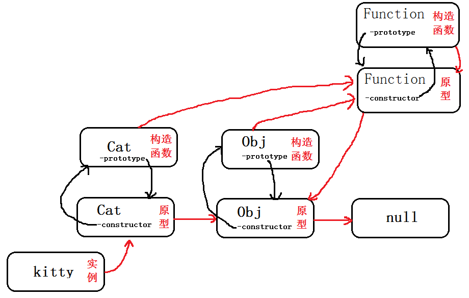

# 业内的三座大山

## 原型和原型链

+ 笔记中已经简单的简述了下原型和原型链等，此处做一些补充和重点再提

+ 原型分两类：显式原型(`prototype`)和隐式原型(`__proto__`)

### 通用规则

1. 所有函数都有`prototype`属性，属性值是一个普通对象。
2. 所有的引用类型（数组、对象和函数），都具有自由扩展属性（也就是原型属性啦）。
3. 所有的对象都具有`__proto__`属性，并且指向他们的构造函数的`prototype`属性（js有是万物都是对象，所以所有的都有`__proto__`属性）
4. 如果一个对象找不到本身的属性，那么会寻找构造这个对象的属性。



+ 上图中红的的为`__proto__`的指向

+ 证明如下

``` JS
function Cat(name) {
    this.name = name;
}
var kitty = new Cat('Kitty');

//__proto__部分
kitty.__proto__ === Cat.prototype//true
Cat.prototype.__proto__ === Object.prototype//true
Object.prototype.__proto__ === null//true
Cat.__proto__ === Function.prototype//true
Object.__proto__ === Function.prototype//true
Function.__proto__ === Function.prototype//true
Function.prototype.__proto__ === Object.prototype//true

//prototype部分
Cat.prototype === kitty.__proto__//true
Object.prototype === Cat.prototype.__proto__//true
Function.prototype === Cat.__proto__//true

//constructor部分
kitty.__proto__.constructor === Cat//true
kitty.__proto__.__proto__.constructor === Object//true
Object.__proto__.constructor === Function//true
```

+ 看懂这图就可以明白原型链了

### 变更继承关系

+ 我第一个想到的是通过直接去修改`__proto__`。但是我记得原来我看到的教程中变更继承不是这样操作的。

+ 然后去搜索直接修改`__proto__`有啥弊端，为什么不可以？

找到一篇<a href='https://www.cnblogs.com/wengxuesong/archive/2016/06/14/5580797.html'>文章</a>

大致内容：

1. 移植性问题（兼容性问题），不是所有浏览器都支持
2. 性能问题：所有现代的js引擎都深度优化了获取和设置对象属性的行为，因为这些都是一些常见的js操作。这些优化都是基于引擎对对象结构的认识上。当更改了对象的内部结构（如添加或删除该对象或其原型链中的对象的属性），将会使一些优化失效。修改__proto__属性实际上改变了继承结构本身，这可能是最具破坏性的修改。
3. 保持行为的可预测性。对象的原型链通过其一套确定的属性及属性值来定义它的行为。修改对象的原型链就像对其进行“大脑移植”，这会交换对象的整个层次结构。在某些情况下这样的操作可能是有用的，但是保持继承层次结构的相对稳定是一个基本的原则。

还找到<a href='https://developer.mozilla.org/zh-CN/docs/Web/JavaScript/Reference/Global_Objects/Object/proto'>mozilla文档</a>

+ 我总结如下：

1. 因为已经废弃，（该特性已经从 Web 标准中删除，虽然一些浏览器目前仍然支持它，但也许会在未来的某个时间停止支持，请尽量不要使用该特性。）所以不建议这样使用。
2. 性能问题，影响所有继承的属性对象，去增添和删改属性影响性能，影响属性多的时候，影响性能就大了。
3. 当Object.prototype.__proto__ 已被大多数浏览器厂商所支持的今天，其存在和确切行为仅在ECMAScript 2015规范中被标准化为传统功能，以确保Web浏览器的兼容性。为了更好的支持，建议只使用 Object.getPrototypeOf()。

为啥不这样使用，还是不太明白。因为废弃这个，以后兼容性不足?(先暂时这样认为)。

变更继承方案暂时如下方法：

``` JS
function inherits(Child, Parent) {
    var F = function() {};
    F.prototype = Parent.prototype;
    Child.prototype = new F();
    Child.prototype.constructor = Child;
}

function Cat(name) {
    this.name = name;
}
Cat.prototype.say = function() {
    return "hello," + this.name + "!";
    console.log("hello," + this.name + "!");
}

function LoveCat(cat) {
    // 调用Cat构造函数，绑定this变量:
    Cat.call(this, cat);
    this.age = cat.age;
}

// 实现原型继承链:
inherits(LoveCat, Cat);

// 绑定其他方法到LoveCat原型:
LoveCat.prototype.getAge = function() {
    return this.age;
};
```

## 作用域和闭包


## 异步和单线程