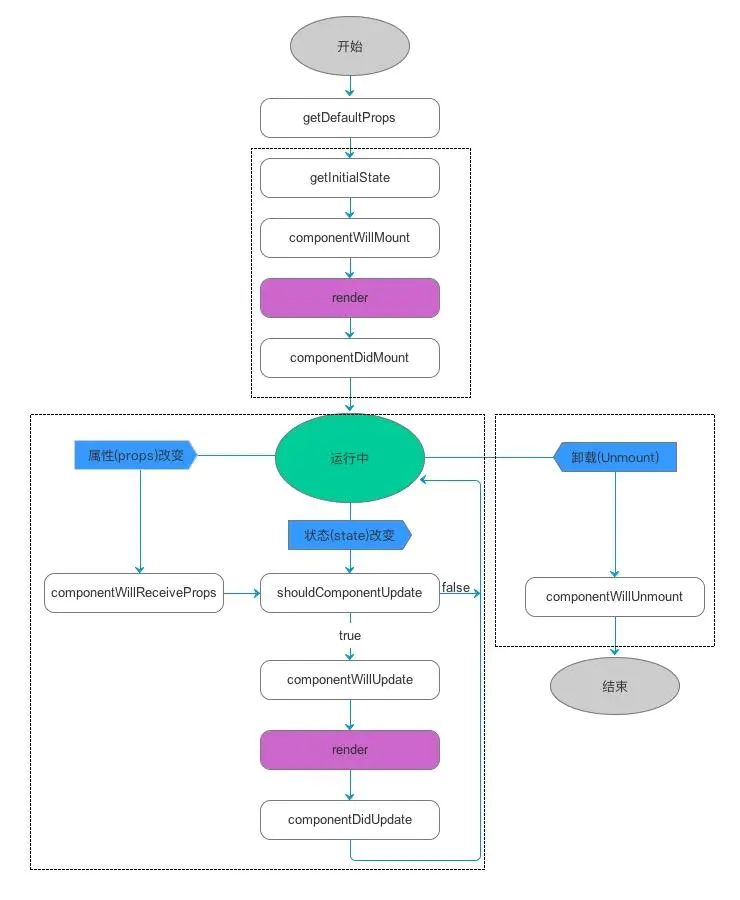

# React学习

## 创建React项目

npx create-react-app my-app
cd my-app
npm start

## 目录介绍

node_modules：各种导入的文件、内容、安装的应用等（文件大且杂）
public：入口文件
src：源文件

## 基础知识

### JSX语法

JSX语法 = JavaScript + XML语法
详解：遇到<>按照HTML语法解析，遇到{}按照JavaScript解析

注意：

1. JSX必须要有根节点。
2. 正常的普通HTML元素要小写。如果是大写，默认认为是组件。
3. 注释

``` jsx
{/* 注释 */}
```

#### JSX样式

1. Class，style中不可以存在多个class属性

``` jsx
<div class = 'abc'  class={‘active’}> 
{/*错误的表示*/}
```

2. style样式中，如果存在多个单词的属性组合，第二个单词开始，首字母大写。或者用引号引起来，否则会报错。

``` jsx
let exampleStyle = {
    background:"skyblue",
    borderBottom:"4px solid red",
    'background-image':"url()"
}
```

3. 多个类写法

``` jsx
className={"abc "+classStr}

let classStr2 = ['abc2','redBg2'].join(" ")
className={classStr2}
```

### 元素渲染

使用JSX的写法，可以创建JS元素对象

注意：JSX元素对象，或者组件对象，必须只有1个根元素（根节点）

### 组件

组件的后缀可以是js，也可以是jsx
一个React项目，是由成千上万的组件构成的

1. 函数式组件

2. class式组件

#### props属性

传入组件的参数
组件内部允许修改props

#### state

和vue的data差不多，但是不一样

1. 使用 `this.setState({a:2})` 来更改state（不使用不会重新渲染组件）

2. 可以是异步也可以是同步的。（异步为了提高性能）

``` js
//回调方法成同步
this.setState({
    count: this.state.count + 1;
}, () => {
    console.log(this.state.count);
})

//promise
setStateAsync(state) {
    return new Promise((resolve, reject) => {
        this.setState(state, resolve);
    })
}

increment = () => {
    this.setStateAsync({
            count: this.state.count + 1
        })
        .then((res) => {
            //console.log(res);//undefined
            console.log(this.state.count)
        })
}
}

//async~await
increment = async () => {
    await this.setState({
        count: this.state.count + 1
    });
    console.log(this.state.count);
}
```

#### 生命周期函数



* 挂载

1. componentWillMount()：组件渲染之前执行。
    - 还没有dom节点
    - ajax，添加动画前的类
2. componentDidMount()：组件渲染之后执行。组件完成第一次渲染。
    - dom节点生成完毕
    - 添加动画

* 销毁

3. componentWillUnmount()：组件卸载前执行。完成组件的卸载和数据销毁。
    - clear所有组件中创建的setTimeout,setInterval
    - 移除组件中的监听
    - 在组件销毁时，ajax请求返回 `setState` 还未完成。会产生warning。

``` JS
    componentDidMount() {
        this.isMount === true
        axios.post().then((res) => {
            this.isMount && this.setState({ // 增加条件ismount为true时
                aaa: res
            })
        })
    }
    componentWillUnmount() {
        this.isMount === false
    }
```

* 更新

4. componentWillReceiveProps (nextProps)：props发生改变时执行。
    - 在接受父组件改变后的props需要重新渲染组件时用到的比较多
    - 接受一个参数nextProps
    - 通过对比nextProps和this.props，将nextProps的state为当前组件的state，从而重新渲染组件

5. shouldComponentUpdate(nextProps,nextState)：返回false和true。true表示允许改变，false表示不允许。
    - 主要用于性能优化(部分更新)
    - 唯一用于控制组件重新渲染的生命周期，由于在react中，setState以后，state发生变化，组件会进入重新渲染的流程，在这里return false可以阻止组件的更新
    - 因为react父组件的重新渲染会导致其所有子组件的重新渲染，这个时候其实我们是不需要所有子组件都跟着重新渲染的，因此需要在子组件的该生命周期中做判断

6. componentWillUpdate (nextProps,nextState)：在组件接收到新的props或者state但还没有render时被调用。

7. componentDidUpdate(prevProps,prevState)：在组件完成更新后立即调用。

#### 父传子

* 父传递给子组件数据，单向流动，不能子传递给父。
* props的传值，可以是任意的类型。

#### 子传父

* props可以传递函数，props可以传递父元素的函数，就可以去修改父元素的state, 从而达到传递数据给父元素。

#### 事件处理

* React 事件的命名采用小驼峰式（camelCase），而不是纯小写。
* 使用 JSX 语法时你需要传入一个函数作为事件处理函数，而不是一个字符串。
* 事件对象：React返回的事件对象是代理的原生的事件对象，如果想要查看事件对象的具体值，必须之间输出事件对象的属性。

注意：

* 原生，阻止默认行为时，可以直接返回return false；React中，阻止默认必须e.preventDefault(); 

``` jsx
<button onClick={this.sendData}>传递helloworld给父元素</button>

{/*这样会直接执行*/}
<button onClick={this.sendData("123")}>传递helloworld给父元素</button>

{/*解决方案*/}
<button onClick={(e)=>{this.sendData(e,"123")}}>传递helloworld给父元素</button>
```

#### 条件渲染

* 两种情况
* 三目运算符 `condition ? true : false`  `1==1 ? 'true' : 'false'`
1. 直接通过条件运算返回要渲染的JSX对象

``` jsx
function UserGreet(props){
    return (<h1>欢迎登陆</h1>)
}

function UserLogin(props){
    return (<h1>请先登录</h1>)
}

class ParentCom extends React.Component{
    constructor(props){
        super(props)
        this.state = {
            isLogin:true
        }
    }
    render(){
        if(this.state.isLogin){
            return (<UserGreet></UserGreet>)
        }else{
            return (<UserLogin></UserLogin>)
        }
    }
}
```

2. 通过条件运算得出jsx对象，在将JSX对象渲染到模板中

``` jsx
render(){
        let element = null;
        if(this.state.isLogin){
            element = <UserGreet></UserGreet>;
        }else{
            element = (<UserLogin></UserLogin>);
        }
        return (
            <div>
                {element}
            </div>
        )
    }
```

#### 列表和key

* 使用数组的map方法，对每一项数据按照JSX的形式进行加工，最终得到1个每一项都是JSX对象的数组，在将数组渲染到模板中。

* key放到数组每一项中（key在diff算法中是提升渲染效率的方法）

#### refs和dom

1. 管理焦点，文本选择或媒体播放。
2. 触发强制动画。
3. 集成第三方 DOM 库。

``` jsx
class CustomTextInput extends React.Component {
  constructor(props) {
    super(props);
    // 创建一个 ref 来存储 textInput 的 DOM 元素
    this.textInput = React.createRef();
    this.focusTextInput = this.focusTextInput.bind(this);
  }

  focusTextInput() {
    // 直接使用原生 API 使 text 输入框获得焦点
    // 注意：我们通过 "current" 来访问 DOM 节点
    this.textInput.current.focus();
  }

  render() {
    // 告诉 React 我们想把 <input> ref 关联到
    // 构造器里创建的 `textInput` 上
    return (
      <div>
        <input
          type="text"
          ref={this.textInput} />
        <input
          type="button"
          value="Focus the text input"
          onClick={this.focusTextInput}
        />
      </div>
    );
  }
}
```

#### 表单

1. 受控组件

* 使 React 的 state 成为“唯一数据源”。渲染表单的 React 组件还控制着用户输入过程中表单发生的操作。

``` jsx
class NameForm extends React.Component {
  constructor(props) {
    super(props);
    this.state = {value: ''};
  }

  handleChange = (event) => {
    this.setState({value: event.target.value});
  }

  handleSubmit = (event) => {
    alert('提交的名字: ' + this.state.value);
    event.preventDefault();
  }

  render() {
    return (
      <form onSubmit={this.handleSubmit}>
        <label>
          名字:
          <input type="text" value={this.state.value} onChange={this.handleChange} />
        </label>
        <input type="submit" value="提交" />
      </form>
    );
  }
}
```

2. 非受控组件

* 通过ref来直接操作dom

#### 状态提升

* 将共享状态提升到最近的共同父组件

#### 组合（可以拿来实现插槽功能）

* 组件中写入的HTML，可以传入到props中

#### PropTypes进行类型检查

``` jsx
import PropTypes from 'prop-types';

class Greeting extends React.Component {
  render() {
    return (
      <h1>Hello, {this.props.name}</h1>
    );
  }
}

Greeting.propTypes = {
  name: PropTypes.string
};
```

### Hook

+ `Hook` 是 `React 16.8` 的新增特性。它可以让你在不编写 `class` 的情况下使用 `state` 以及其他的 `React` 特性。

+ `Hook` 是一个特殊的函数，它可以让你“钩入” `React` 的特性。

#### State Hook

+ `useState` 是允许你在 `React` 函数组件中添加 `state` 的 `Hook`。

``` jsx
class Example extends React.Component {
  constructor(props) {
    super(props);
    this.state = {
      count: 0
    };
  }

  render() {
    return (
      <div>
        <p>You clicked {this.state.count} times</p>
        <button onClick={() => this.setState({ count: this.state.count + 1 })}>
          Click me
        </button>
      </div>
    );
  }
}
```

等价

``` jsx
import React, { useState } from 'react';

function Example() {
  // 声明一个叫 "count" 的 state 变量
  const [count, setCount] = useState(0);

  return (
    <div>
      <p>You clicked {count} times</p>
      <button onClick={() => setCount(count + 1)}>
        Click me
      </button>
    </div>
  );
}
```


#### Effect Hook


# React-Router

* [官网简介](https://reactrouter.com/web/guides/quick-start)

## 基础使用

* 官方文档的使用案例一

``` jsx
import React from "react";
import {
  BrowserRouter as Router,
  Switch,
  Route,
  Link
} from "react-router-dom";

export default function App() {
  return (
    <Router>
      <div>
        <nav>
          <ul>
            <li>
              <Link to="/">Home</Link>
            </li>
            <li>
              <Link to="/about">About</Link>
            </li>
            <li>
              <Link to="/users">Users</Link>
            </li>
          </ul>
        </nav>

        {/* A <Switch> looks through its children <Route>s and
            renders the first one that matches the current URL. */}
        <Switch>
          <Route path="/about">
            <About />
          </Route>
          <Route path="/users">
            <Users />
          </Route>
          <Route path="/">
            <Home />
          </Route>
        </Switch>
      </div>
    </Router>
  );
}

function Home() {
  return <h2>Home</h2>;
}

function About() {
  return <h2>About</h2>;
}

function Users() {
  return <h2>Users</h2>;
}
```

### BrowserRouter & HashRouter

* `BrowserRouter` : `history`
  + 上线需要后台做处理。重定向问题（刷新页面的时候）

* `HashRouter` : 锚点链接

### Link

``` jsx
<Link to="/about">About</Link>

<Link to="/courses?sort=name" />

<Link
  to={{
    pathname: "/courses",
    search: "?sort=name",
    hash: "#the-hash",
    state: { fromDashboard: true }
  }}
/>
```

* pathname: 链接的路由
* search: 查询参数的字符串
* hash: 拼接在search后面
* state: 传隐形参数

### Switch

* 只呈现一个路由

``` jsx
<Switch>
    <Route exact path="/" component={Home}/>
    <Route path="/about" component={About}/>
    <Route path="/:user" component={User}/>
    <Route component={ NotFound }/>
  </Switch>
```

### Route

1. `component` : 放置组件，路由加载组件

``` jsx
<Route path="/" component={Home}/>
```

2. `render(func)` : 放置组件的渲染内容

``` jsx
<Route path="/home" render={() => <div>Home</div>} />
```

3. `path(string)` : 填路由路径

4. `exact(bool)` : 完全一致时才匹配，精准匹配

| path | location.pathname | exact | matches? |
|------|:-----------------:|:-----:|---------:|
| /one |      /one/two     |  true |       no |
| /one |      /one/two     | false |      yes |

5. `strict(bool)` : 

  + 带斜杠的路径将只匹配带斜杠的

| path  | location.pathname | matches? |
|-------|-------------------|---------:|
| /one/ | /one              |       no |
| /one/ | /one/             |      yes |
| /one/ | /one/two          |      yes |

  + 更加精准匹配（不匹配有斜杠的，需要exact也是true）

| path | location.pathname | matches? |
|------|-------------------|---------:|
| /one | /one              |      yes |
| /one | /one/             |       no |
| /one | /one/two          |       no |

6. `sensitive(bool)` : 区分大小写匹配

| path | location.pathname | sensitive | matches? |
|------|-------------------|:---------:|---------:|
| /one | /one              |    true   |      yes |
| /One | /one              |    true   |       no |
| /One | /one              |   false   |      yes |

7. `path`: 传参数

``` jsx
<Route path="/users/:id" component={User}/>
```


### NavLink

1. `activeClassName(string)`: 元素处于活动状态时提供的类名。默认是active。

2. `activeStyle`: 活动时应用此样式

  - 注意：是`{{}}`两个大括号

``` jsx
<NavLink
  to="/faq"
  activeStyle={{
    fontWeight: "bold",
    color: "red"
  }}
>
  FAQs
</NavLink>
```

### Redirect

+ 基础使用方法

``` jsx
<Redirect to="/somewhere/else" />
```

### withRouter

+ 当组件没有直接被路由管理时，所以没有路由对象。用这个可以让组件获得路由对象

``` jsx
export default withRouter(组件名)
```


### props（代码跳转）

+ 跳转组件接收到的`props`中有`history`、`location`、`match`

+ 可以通过`history`下的一些方法实现页面跳转。`push`、`replace`、`go`、`goBack`等

``` jsx
props.history.push("/",{msg:"这是传递的数据"})
```

### Prompt

+ 用于提示用户离开页面确认操作

``` jsx
<Prompt
  when={formIsHalfFilledOut}
  message="Are you sure you want to leave?"
/>
```

### 路由嵌套

+ 这个也可以做到插槽的效果

``` jsx
<Router>
  <nav>
        <ul>
          <li>
            <Link to="/Shop">Shop</Link>
          </li>
          <li>
            <Link to="/Book">Book</Link>
          </li>
          <li>
            <Link to="/Book/WebBook">webBook</Link>
          </li>
          <li>
            <Link to="/Book/JavaBook">JavaBook</Link>
          </li>
        </ul>
  </nav>
  <Switch>
    <Route path="/Shop" component={Shop}></Route>
    {/* <Route path="/Book" component={Book}></Route> */}
    <Route path="/Book">
      <Book>
        <Switch>
          <Route path="/Book/WebBook" component={WebBook}></Route>
          <Route path="/Book/JavaBook" component={JavaBook}></Route>
        </Switch>
      </Book>
    </Route>
  </Switch>
</Router>

<div>
  Book:
  {/* 路由嵌套显示的位置 */}
  {this.props.children}
</div>
```

# Redux


`````````````
