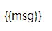

# Vue.js笔记

## 查看Vue的版本

1. 查看package.json文件

2. 终端查看

    - 查看vue-cli版本号`vue -V`
    - 全局查看vue的版本号`npm info vue`
    - 局部（当前项目）查看vue的版本号`npm list vue version`

## 什么是Vue.js

* Vue.js 是前端的主流框架之一，和Angular.js、React.js 一起，并成为前端三大主流框架！
* Vue.js 是一套构建用户界面的框架，只关注视图层，它不仅易于上手，还便于与第三方库或既有项目整合。（Vue有配套的第三方类库，可以整合起来做大型项目的开发）

## 框架和库的区别

* 框架：是一套完整的解决方案；对项目的侵入性较大，项目如果需要更换框架，则需要重新架构整个项目。

   + java 中 的Spring

* 库（插件）：提供某一个小功能，对项目的侵入性较小，如果某个库无法完成某些需求，可以很容易切换到其它库实现需求。

## MVVM模型

* MVVM是前端视图层的概念，主要关注于 视图层分离，也就是说：MVVM把前端的视图层，分为了 三部分 Model, View , VM ViewModel

## Vue.js代码与MVVM的对应关系

``` HTML
<!DOCTYPE html>
<html lang="en">

<head>
  <meta charset="UTF-8">
  <meta name="viewport" content="width=device-width, initial-scale=1.0">
  <meta http-equiv="X-UA-Compatible" content="ie=edge">
  <title>Document</title>
  <!-- 1. 导包 -->
  <script src="./lib/vue.js"></script>
</head>

<body>
  <!-- new 的实例会控制这个元素的内容-->
  <!-- Vue 实例所控制的这个元素区域，就是我们的 V  -->
  <div id="app">
    <p>{{msg}}</p>
  </div>
  <script>
    // 2.创建一个Vue的实例
    // 当我们导入包之后，在浏览器的内存中，就多了一个 Vue 构造函数
    //
    //  注意：我们 new 出来的这个 vm 对象，就是我们 MVVM中的 VM调度者
    var vm = new Vue({
      el: '#app', //表示当前我们new的这个vue的实例，要控制的区域
      // 这里的 data 就是 MVVM中的 M，专门用来保存 每个页面的数据的
      data: { //data属性中，存放的是el中要用到的数据
        msg: '欢迎学习Vue' // 通过 Vue 提供的指令，很方便的就能把数据渲染到页面上，程序员不再手动操作DOM元素了
        //【前端的Vue之类的框架，不提倡我们去手动操作DOM元素了】
      }
    })
  </script>
</body>

</html>
```

## Vue之 - 基本的代码结构和 `插值表达式` 、 `v-cloak` 

### 插值表达式

``` HTML
<!DOCTYPE html>
<html lang="en">

<head>
  <meta charset="UTF-8">
  <meta name="viewport" content="width=device-width, initial-scale=1.0">
  <meta http-equiv="X-UA-Compatible" content="ie=edge">
  <title>Document</title>
</head>

<body>
  <div id="app">
    <p>{{msg}}</p>
  </div>
  <!--当包的请求放在下面的时候，会因为包还未请求到，导致插值表达式直接在页面中显示-->
  <script src="./lib/vue.js"></script>

  <script>
    var vm = new Vue({
      el: '#app',
      data: {
        msg: '欢迎学习Vue'
      }
    })
  </script>
</body>

</html>
```



插值表达式存在直接显示问题

### V-cloak

**针对有时候页面加载时出现 vuejs 的变量名**

``` HTML
<!DOCTYPE html>
<html lang="en">

<head>
  <meta charset="UTF-8">
  <meta name="viewport" content="width=device-width, initial-scale=1.0">
  <meta http-equiv="X-UA-Compatible" content="ie=edge">
  <title>Document</title>
  <style>
    /* v-cloak 的display属性可能会被优先级别高的样式覆盖，所以加上 !important.*/
    [v-cloak] {
      display: none !important;
    }
  </style>
</head>

<body>
  <div id="app">
    <p v-clock>{{msg}}</p>

  </div>
  <!--如此当包还为下载完毕时，上面的p便签内的内容display的属性会为none-->
  <script src="./lib/vue.js"></script>
  <script>
    var vm = new Vue({
      el: '#app',
      data: {
        msg: '欢迎学习Vue'
      }
    })
  </script>
</body>

</html>
```

### Vue指令之 `v-text` 和 `v-html` 和插值表达式

* 插值表达式是把数据插入到自己的占位符
* `v-text` 是覆盖元素中原本的内容
* `v-html` 是当成html代码去插入，用前两者只会输出文本形式

### Vue指令之 `v-bind` 的三种用法

**此指令用来绑定数据使用**

1. 直接使用指令 `v-bind` 
2. 简化指令使用为 `：` 
3. 在绑定的时候，拼接绑定内容： `:title="btnTitle + ', 这是追加的内容'"` 

