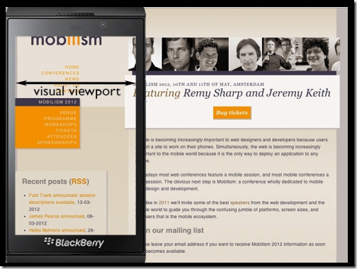

# 移动端适配的基础知识

* 本文内内容来源杂乱，各种博客（CSDN等）各种教程（菜鸟教程等）。自己整理写下此文。可能存在错误，尽请大佬斧正。

邮箱（zt0306@qq.com）

## viewport

* 说到viewport，就会讲到ppk大佬的研究（

<a href = 'https://www.quirksmode.org/mobile/viewports.html'>第一篇</a>、
<a href = 'http://www.quirksmode.org/mobile/viewports2.html'>第二篇</a>、
<a href = 'https://www.quirksmode.org/mobile/metaviewport/'>第三篇</a>）
前两篇我找到译文<a href = 'https://www.w3cplus.com/css/viewports.html'>viewports剖析</a>，第三篇没有找到译文，找到一篇部分和第三篇部分相似的<a href = 'https://www.cnblogs.com/2050/p/3877280.html'>博客</a>，
有兴趣的都可以去拜读下。

* viewport 是用户网页的可视区域。（菜鸟教程中的定义）
* viewport 我理解是：在桌面浏览器中，viewport就是浏览器的窗口。在移动设备中，比较复杂。根据ppk大佬，分为三个**layout viewport**和**visual viewport**和**ideal viewport**。(这三个viewport在下文会详细解释)


> 图片引用自<a href = 'https://www.w3cplus.com/css/vw-for-layout.html?a=b'>再聊移动端页面的适配</a>

* 上图是对viewport的部分常用内容的说明，详细内容还有很多，想要了解的可以去看ppk的前两篇文章，

<a href = 'https://www.quirksmode.org/mobile/viewports.html'>第一篇</a>、
<a href = 'http://www.quirksmode.org/mobile/viewports2.html'>第二篇</a>、
译文：<a href = 'https://www.w3cplus.com/css/viewports.html'>viewports剖析</a>

---

## PPK的关于三个viewport的理论

### layout viewport

* layout viewport是整个网页，包含你看到的和看不到的元素（滚动条之外的）


> 图片引用自<a href = 'https://www.cnblogs.com/2050/p/3877280.html'>移动前端开发之viewport的深入理解</a>

### visual viewport

* visual viewport是页面上当前显示在屏幕上的部分



> 图片引用自<a href = 'https://www.cnblogs.com/2050/p/3877280.html'>移动前端开发之viewport的深入理解</a>

这个就好比游戏里的地图，layoutViewport是大地图，visualViewport是大地图中框起来的那块。


> 如图所示

你要是还看不懂的话<a href = 'https://stackoverflow.com/questions/6333927/difference-between-visual-viewport-and-layout-viewport'>点此</a>, 也可以帮你去理解这两个viewport的区别。

### ideal viewport

* 现在我们已经有两个viewport了：**layout viewport** 和 **visual viewport**。但浏览器觉得还不够，因为现在越来越多的网站都会为移动设备进行单独的设计，所以必须还要有一个能完美适配移动设备的viewport。所谓的完美适配指的是，首先不需要用户缩放和横向滚动条就能正常的查看网站的所有内容；第二，显示的文字的大小是合适，比如一段14px大小的文字，不会因为在一个高密度像素的屏幕里显示得太小而无法看清，理想的情况是这段14px的文字无论是在何种密度屏幕，何种分辨率下，显示出来的大小都是差不多的。当然，不只是文字，其他元素像图片什么的也是这个道理。ppk把这个viewport叫做 **ideal viewport**，也就是第三个viewport——移动设备的理想viewport。

## 像素部分

### 物理像素(physical pixel)

* 物理像素又被称为设备像素，他是显示设备中一个最微小的物理部件。我们看的所有屏幕都是由像素点构成，足够多，足够密的像素点欺骗人眼，让人以为看到的就是图像。

### 设备独立像素(density-independent pixel)

* 与设备无关的逻辑像素，代表可以通过程序控制使用的虚拟像素，是一个总体概念，包括了CSS像素

### CSS像素（CSS Pixel）

* 适用于web编程，指的是我们在样式代码中使用到的逻辑像素，是一个抽象概念，实际并不存在。一般情况之下，CSS像素称为与设备无关的像素(device-independent pixel)，简称DIPs。

### 屏幕密度

* 屏幕密度是指一个设备表面上存在的像素数量，它通常以每英寸有多少像素来计算(PPI)。
* 计算公式（ppi）


* 例子 iPhone6 1334*750像素分辨率 4.7英寸  ppi=根号（1334²+750²）/4.7

### 设备像素比(device pixel ratio)

* 设备像素比，<span style = "font-size:large; ">设备像素/设备独立像素</span>，代表设备独立像素到设备像素的转换关系

* 当设备像素比为1:1时，使用1（1×1）个设备像素显示1个CSS像素。

* 当设备像素比为2:1时，使用4（2×2）个设备像素显示1个CSS像素。

* 当设备像素比为3:1时，使用9（3×3）个设备像素显示1个CSS像素。


> 此图为dpr为2时的css像素对应的设备像素说明

* 在移动端时代屏幕适配除了Layout之外，还要考虑到图片等页面元素的适配，因为其直接影响到页面显示质量。此处发现<a href='https://www.w3cplus.com/css/towards-retina-web.html'>走向视网膜（Retina）的Web时代</a>此文进行了说话。


> 此图由**南宮瑞揚**根据<a href='http://mir.aculo.us/2012/06/26/flowchart-how-to-retinafy-your-website/'>mir.aculo.us</a>的信息图所译。(我找不到南宮瑞揚的文章，所以没法给出超连接)

> 并且上图本人没有实际测试过，大佬说他可行。那应当是可行的。当然我们还是要存在对其的质疑（毕竟自己没有测试过），要有质疑权威的信心。

## CSS部分

### meta标签

`<meta>` 标签有很多种，而这里要着重说的是viewport的meta标签，其主要用来告诉浏览器如何规范的渲染Web页面，而你则需要告诉它视窗有多大。在开发移动端页面，我们需要设置meta标签如下：

``` HTML
<meta name="viewport" content="width=device-width, initial-scale=1, maximum-scale=1">
```

* 该meta标签的作用是让当前viewport的宽度等于设备的宽度，页面初始缩放值为1. 最大缩放值为1。

| 属性名         |                                                     说明 |
|---------------|:--------------------------------------------------------:|
| width         | 设置layout viewport的宽度，为一个正整数，或字符串"width-device" |
| initial-scale |                     设置页面的初始缩放值，为一个数字，可以带小数 |
| minimum-scale |                     允许用户的最小缩放值，为一个数字，可以带小数 |
| maximum-scale |                     允许用户的最大缩放值，为一个数字，可以带小数 |
| height        |    设置layout viewport  的高度，这个属性对我们并不重要，很少使用 |
| user-scalable | 是否允许用户进行缩放，值为"no"或"yes", no 代表不允许，yes代表允许 |

+ 当前缩放值 = ideal viewport宽度  / visual viewport宽度

+ 想要了解更多请点击<a href='https://www.cnblogs.com/2050/p/3877280.html'>这里</a>

### rem,em,px,vh,vw,vmin,vmax

+ px：绝对单位，页面按精确像素展示、

+ em：相对单位，基准点为父节点字体的大小，如果自身定义了font-size按自身来计算（浏览器默认字体是16px），整个页面内1em不是一个固定的值。em了解更多<a href='https://www.runoob.com/w3cnote/px-em-rem-different.html'>点击此处</a>！
  1. em的值并不是固定的。
  2. em会继承父级元素的字体大小。
  3. 注意em的字体大小逐层复合的连锁反应。

+ rem：相对单位（root em，根em），CSS3新加属性（chrome强制最小字体为12号，即使设置成 10px 最终都会显示成 12px，当把html的font-size设置成10px,子节点rem的计算还是以12px为基准）

+ vw：viewpoint width，视窗宽度，1vw等于视窗宽度的1%。
+ vh：viewpoint height，视窗高度，1vh等于视窗高度的1%。
+ vmin：vw和vh中较小的那个。
+ vmax：vw和vh中较大的那个。

